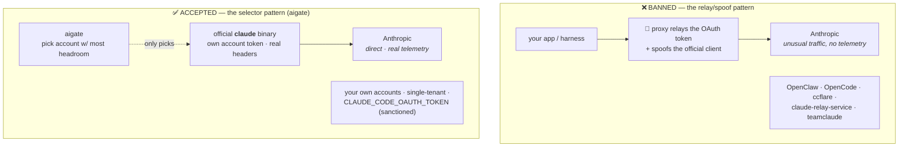

<div align="center">

# ⚖️ aigate — Compliance

### *Multi-account Claude, the way Anthropic says is allowed — with receipts.*


</div>

---

> [!IMPORTANT]
> **The one rule that decides everything: *who makes the request?***
> A third-party harness that **spoofs** the official client with your subscription token → **banned.**
> The **real `claude` binary**, running **your own** accounts → **accepted.**
> **aigate is architected to always be the second thing.** For Claude it is a *selector*, never a proxy — it picks which account's token the *official* binary launches with, then gets out of the way. It is **never in Anthropic's request path**.

---

## 🧭 TL;DR

| ✅ aigate does | ❌ aigate never does |
|---|---|
| Runs the **official `claude` binary** | Spoof / impersonate the Claude Code client |
| Balances **your own** accounts by real headroom | Route requests **on behalf of other users** |
| Injects the picked account's token into the **official client** (clean credential store, no shadow login) | Extract tokens to feed a third-party harness |
| Stays **single-tenant** (just you) | Resell / share access, or pool for a team |
| Uses a real proxy **only for API-key providers** (OpenAI, fal, …) | Proxy/relay **Claude subscription OAuth** |

If you can't say "these are **my** accounts and **I'm** the only user," you're outside what this doc covers — use an [API key](https://platform.claude.com/) instead.

---

## 🚧 The line, drawn

**Anthropic's enforcement targets exactly two things:** (1) **reselling or sharing** accounts, and (2) **harnesses that spoof the official client** — forged headers, no telemetry ([their eng's own words](https://x.com/trq212/status/2009689809875591565)). aigate does **neither**: it never resells or shares, and it runs the *real* `claude` binary, so there are **no forged headers** and Anthropic sees normal, honest telemetry.



---

## ✅ The three tests aigate passes

| Test | ❌ Banned tools | ✅ aigate |
|---|---|---|
| **Who makes the request?** | a proxy spoofing the client | the **official `claude` binary** |
| **Whose accounts?** | routes on behalf of *other users* / resells | **only your own** |
| **Evading limits?** | sharding one workload to dodge caps | picks headroom for *ordinary individual use* |

---

## 📜 What Anthropic actually says (verbatim)

From Anthropic's **[Claude Code — Legal & Compliance](https://code.claude.com/docs/en/legal-and-compliance)** page:

> "OAuth authentication is intended exclusively for purchasers of Claude Free, Pro, Max, Team, and Enterprise subscription plans and is designed to support **ordinary use of Claude Code and other native Anthropic applications**."

> "Anthropic does not permit third-party developers to offer Claude.ai login or to **route requests through Free, Pro, or Max plan credentials on behalf of their users**."

> "Advertised usage limits for Pro and Max plans assume **ordinary, individual usage** of Claude Code and the Agent SDK."

**Read closely:** the prohibition is scoped to developers routing subscription credentials **on behalf of *their users*** — i.e. serving *other people*. Running the official binary on your *own* accounts, as the *only* user, is the "ordinary, individual usage" lane. aigate is built to stay in it.

---

## 📎 Receipts — the primary sources

| Source | What it establishes | Verified |
|---|---|---|
| ⚖️ [Anthropic — Claude Code Legal & Compliance](https://code.claude.com/docs/en/legal-and-compliance) | The authoritative policy (quotes above). | ✅ fetched live |
| 🐦 [Thariq Shihipar (@trq212), Claude Code @ Anthropic — Jan 9, 2026](https://x.com/trq212/status/2009689809875591565) | Names the **banned** pattern: *"we tightened our safeguards against **spoofing the Claude Code harness** … third-party harnesses using Claude subscriptions … are **prohibited** by our Terms of Service."* aigate runs the real binary — no spoofing. | ✅ thread confirmed |
| 🐦 [Thariq Shihipar — Feb 19, 2026](https://x.com/trq212/status/2024212378402095389) | *"Nothing is changing about how you can use the Agent SDK and MAX subscriptions."* | ⚠️ via 2 write-ups |
| 🗞️ Anthropic → The New Stack (Feb 2026) | *"Nothing changes around how customers have been using their account and Anthropic **will not be canceling accounts**."* | ⚠️ press-reported |
| 🧩 [anthropics/claude-code #261](https://github.com/anthropics/claude-code/issues/261) · [#33430](https://github.com/anthropics/claude-code/issues/33430) | Anthropic's **own repo** treating **multiple accounts on one machine** (and per-account `CLAUDE_CONFIG_DIR` isolation) as an ordinary, supported setup. | ✅ primary repo |

> [!NOTE]
> **On the ⚠️ rows:** the two tweet/press items are cross-referenced from multiple independent write-ups citing the exact URL + quote, but X blocks automated fetching, so we can't machine-verify them the way we did the legal page and the Jan 9 thread. Treat the ✅ rows as load-bearing; the ⚠️ rows as strong corroboration. If any link rots, open an issue — this file is meant to stay true.

---

## 🛡️ How aigate stays on the accepted side (mechanically)

```mermaid
sequenceDiagram
  autonumber
  participant Box as 🖥️ your box
  participant AG as 🛡️ aigate (selector)
  participant CL as 🤖 official claude binary
  participant AN as 🟣 Anthropic
  Box->>AG: GET /api/select  (which of MY accounts has headroom?)
  AG-->>Box: { account, setup_token }  📝 audited (IP + host)
  Note over Box,CL: injected account token, clean credential store — no relay, no spoofed headers
  Box->>CL: run OFFICIAL claude with that account's token
  CL->>AN: normal Claude Code request 🔑 (direct, real telemetry)
  AN-->>CL: response + rate-limit headers
  Note over AG,AN: aigate polls headroom on its OWN tokens, never in the request path
```

- **Official binary, always.** aigate hands a token to the real `claude` client. It never crafts, spoofs, or relays a request to `api.anthropic.com` on Claude's behalf.
- **The picked account actually serves.** aigate injects the chosen account's token via `CLAUDE_CODE_OAUTH_TOKEN` into the official client and keeps the credential store clean of any stale/competing login — so the account you *picked* is the account that *serves*, with no cross-account bleed. (Anthropic also blesses per-account [`CLAUDE_CONFIG_DIR`](https://github.com/anthropics/claude-code/issues/261) isolation if you'd rather use that.)
- **Your accounts only.** Tokens are stored AES-256-GCM encrypted and only ever handed back to *your* boxes. No third party, no other users.
- **Honest telemetry.** Because it's the real client, Anthropic sees normal usage patterns — the *opposite* of the "unusual traffic without telemetry" that triggers enforcement.

---

## ⚠️ Where *you* could still cross the line (respect this)

aigate keeps the **architecture** compliant; it can't stop you from **using** it in a banned way. Don't:

| ❌ Don't | Why |
|---|---|
| Shard one heavy 24/7 workload across N accounts to beat the weekly cap | **Limit evasion** — bannable *even with the official binary* |
| Ship a token to a machine used by a **different person** | Crosses into "on behalf of another user" |
| Point aigate's Claude path at a relay/proxy | That's the spoofing pattern; keep the **no-relay-for-Claude guardrail sacred** |
| Resell or share account access | Explicit ToS violation, instant ban |
| Over-drain a subscription for API-grade work | Prefer an **API-key fallback** (Console pay-go) |

**When in doubt:** if the work is programmatic/heavy or another human benefits, use an **[API key](https://platform.claude.com/)** — it's the sanctioned path and it's what aigate's roadmap proxy is *for* (API-key providers only).

---

## 🔀 The non-Claude half (API keys are different)

The prohibition above is about **Claude subscription OAuth**. Ordinary **API keys** (OpenAI, OpenRouter, Gemini, Groq, fal, …) are *meant* for programmatic use — so aigate's roadmap **secure proxy** injects those server-side freely. That's a normal API gateway and carries none of the subscription-OAuth restrictions.

| Provider type | aigate mode | In the request path? | Compliance |
|---|---|---|---|
| **Claude subscriptions** (OAuth) | 🎯 Selector — official binary | ❌ never | ✅ accepted architecture |
| **API-key providers** | 🔀 Secure proxy *(roadmap)* | ✅ standard | ✅ normal for API keys |

---

<div align="center">

**⚖️ Personal · honest · visible.** Multiple *personal* subscriptions via the official client is fine — pooling or reselling for others is not. aigate exists to give you the visibility to stay honest. 🛡️

*Found a link that rotted, or a policy that changed? [Open an issue](https://github.com/shoemoney/aigate/issues) — compliance docs are only useful if they stay true.*

</div>
