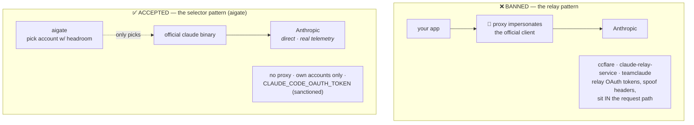
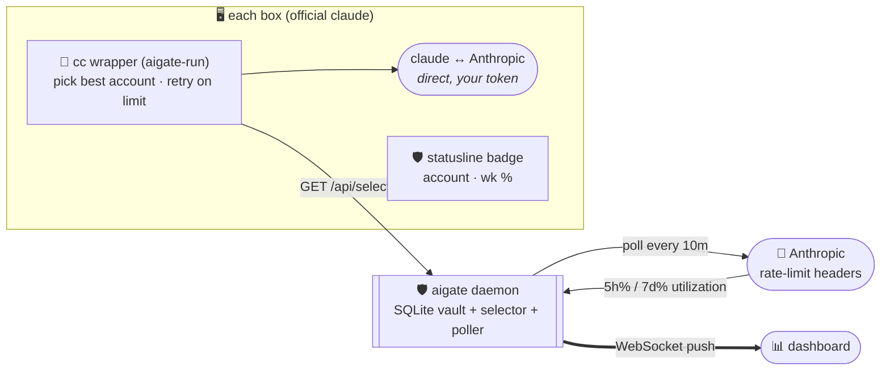
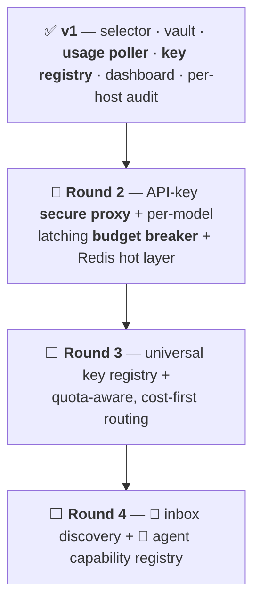

<div align="center">

# 🛡️ aigate

### **The AI Secure Proxy & Load Balancer**

*One self-hosted place that holds every AI credential you own, hands them out **the compliant way**, balances by **real rate-limit headroom**, and shows you **live what's using what** — so nothing runs away at 2am.*


-lightgrey)
[](COMPLIANCE.md)


</div>

---

<div align="center">

## 💛 Shoutout to Theo

**This one's for [Theo Browne](https://t3.gg) — [@t3dotgg](https://x.com/theo).**

If you found this repo through his channel: **welcome in.** 🎬 I build the way I build because of people who make it fun to watch someone care about their craft — and Theo is at the top of that list. The bias for shipping, the "just self-host it," the allergy to over-engineered nonsense — a lot of that rubbed off from years of his videos. **Thank you, genuinely. I owe you a ton.** 🙏

[🌐 t3.gg](https://t3.gg) · [💬 t3.chat](https://t3.chat) · [▶️ YouTube](https://youtube.com/@t3dotgg) · [🐦 @theo](https://x.com/theo) · [⚡ create.t3.gg](https://create.t3.gg) · [📦 UploadThing](https://uploadthing.com)

</div>

---

> [!NOTE]
> **Status: v1 shipped, fleet-verified.** The daemon — encrypted vault, **headroom-aware Claude account selector**, **server-side usage poller**, **provider-key registry**, WebSocket dashboard, full audit — is real and running on live machines. The **secure proxy for API-key providers** and **latching budget breaker** are the roadmap → see **[VISION.md](VISION.md)**. Nothing below is vaporware; the ⬜ rows just aren't built yet.

Built by someone who woke up to a **$500 OpenRouter bill** from a rogue loop and had **no idea which of 35 machines did it.** aigate is the tool that would've caught it at 2am. 😴💸

---

## 🧭 Contents

| | | |
|---|---|---|
| [🤔 Why](#-why-not-just-a-proxy) | [⚖️ Compliance](#️-compliance-the-whole-point) | [🧠 Concepts](#-core-concepts) |
| [🏗️ Architecture](#️-architecture) | [🔁 How it works](#-how-it-works) | [✨ Features](#-features-v1) |
| [🚀 Quick start](#-quick-start) | [🔌 Wire up a box](#-wire-up-a-box-client-side) | [🧪 Prove it switches](#-prove-it-actually-switches) |
| [📡 API](#-api-reference) | [⚙️ Config](#️-config) | [🗺️ Roadmap](#️-roadmap) |

---

## 🤔 Why (not just a proxy?)

Multiple Claude Max subscriptions are **not against ToS** — Anthropic's Claude Code team [said so on the record](https://x.com/trq212/status/2024212378402095389) and told The New Stack they *"will not be canceling accounts."* What gets accounts **banned** is [relaying subscription tokens through a harness that spoofs the official client](https://x.com/trq212/status/2009689809875591565). aigate stays firmly on the **accepted** side of that line for Claude, and uses a normal secure proxy only where it's safe:

| Provider type | aigate mode | In Anthropic's request path? | Safe? |
|---|---|---|---|
| **Claude subscriptions** (OAuth) | 🎯 **Selector** — runs the *official* `claude` binary with the best account's token | ❌ **never** | ✅ accepted architecture |
| **API-key providers** (OpenRouter, OpenAI, Gemini…) | 🔀 **Secure proxy** — injects the real key, meters spend *(roadmap)* | ✅ (standard) | ✅ normal for API keys |

**Clients only ever hold an aigate token — never a raw provider key.** 🔐

---

## ⚖️ Compliance (the whole point)

> Most "multi-account Claude" tools get this **wrong** and get people banned. aigate is built specifically to get it **right.** Here's the line, in Anthropic's own words, and where every tool falls.
>
> 📋 **Full policy analysis + every primary-source receipt → [COMPLIANCE.md](COMPLIANCE.md).**

Anthropic's [Claude Code legal & compliance page](https://code.claude.com/docs/en/legal-and-compliance) is unusually explicit. The banned pattern is **routing requests through Free/Pro/Max plan credentials on behalf of users via a harness that spoofs the official client** — in Anthropic's own words ([Thariq Shihipar, Claude Code @ Anthropic — Jan 9, 2026](https://x.com/trq212/status/2009689809875591565)): *"we tightened our safeguards against spoofing the Claude Code harness … third-party harnesses using Claude subscriptions … are prohibited by our Terms of Service."* Running **your own** multiple accounts through the **official** client is a different thing entirely — he [confirmed on Feb 19, 2026](https://x.com/trq212/status/2024212378402095389) *"Nothing is changing about how you can use the Agent SDK and MAX subscriptions,"* and Anthropic itself acknowledges [`CLAUDE_CONFIG_DIR`](https://github.com/anthropics/claude-code/issues/261) as the sanctioned multi-account isolation mechanism. aigate never spoofs the harness — it runs the **real `claude` binary** — so it stays on the accepted side.



**Three tests aigate passes:**

| Test | Banned tools | aigate |
|---|---|---|
| **Who makes the request?** | a proxy spoofing the client | the **official `claude` binary** ✅ |
| **Whose accounts?** | routes on behalf of *other users* / resells | **only your own** ✅ |
| **Evading limits?** | sticky sessions *designed* to dodge caps | picks headroom for *ordinary individual use* ✅ |

> [!WARNING]
> **The one soft spot — respect it.** Keep aigate **single-tenant** and each account's usage within *ordinary individual* bounds. Do **not** shard one heavy 24/7 workload across N accounts to beat the weekly cap — that's *limit evasion*, bannable even with the official binary. Prefer an **API-key fallback** (Console pay-go) over over-draining a subscription. Never ship a token to a machine used by a different person.

### 📎 Receipts — read the primary sources yourself

Don't take my word for it. Here's the line, from Anthropic directly:

| Source | What it establishes |
|---|---|
| ⚖️ [Anthropic — Claude Code Legal & Compliance](https://code.claude.com/docs/en/legal-and-compliance) | The authoritative policy: OAuth is for *"ordinary use of Claude Code and other native Anthropic applications"*; developers routing subscription creds **on behalf of their users** must use API keys. |
| 🐦 [Thariq Shihipar (@trq212), Claude Code @ Anthropic — Jan 9, 2026](https://x.com/trq212/status/2009689809875591565) | Names the **banned** pattern: *harnesses that **spoof** the Claude Code client* using subscription tokens. aigate runs the real binary — it doesn't spoof. |
| 🐦 [Thariq Shihipar — Feb 19, 2026](https://x.com/trq212/status/2024212378402095389) | *"Nothing is changing about how you can use the Agent SDK and MAX subscriptions."* |
| 🧩 [anthropics/claude-code #261](https://github.com/anthropics/claude-code/issues/261) · [#33430](https://github.com/anthropics/claude-code/issues/33430) | Anthropic's **own repo** acknowledging **`CLAUDE_CONFIG_DIR`** for per-account isolation — the exact mechanism aigate uses. |

> The through-line: **who makes the request matters.** A harness spoofing the client = banned. The official `claude` binary, your own accounts = accepted. aigate is architected to always be the second thing.

---

## 🧠 Core concepts

```mermaid
mindmap
  root(("🛡️ aigate"))
    🔐 Vault
      AES-256-GCM at rest
      Claude OAuth tokens
      provider API keys
      clients hold aigate token only
    ⚖️ Selection
      most headroom first
      auto-skip ≥95%
      auto-recover after reset
      🔁 exclude + retry on over-limit
    📈 Usage poller
      reads Anthropic rate-limit headers
      every 10 min · no proxy
      per-account 5h + 7d %
    🩺 Self-heal
      /health DB-backed probe
      watchdog exits→restart
      Docker HEALTHCHECK + autoheal
    🧾 Audit
      every handout - IP + host
      every prompt - via hooks
    📊 Live
      WebSocket dashboard
      🚨 runaway detection
      🔑 add/remove provider keys
    🛑 Guards _(roadmap)_
      per model x key caps
      latching breaker
```

---

## 🏗️ Architecture

**No proxy in Anthropic's path.** The daemon only *picks* the account, *records* activity, and *polls* real usage. The official client talks to Anthropic directly.



---

## 🔁 How it works

```mermaid
sequenceDiagram
  autonumber
  participant Box as 🖥️ box
  participant AG as 🛡️ aigate
  participant AN as 🤖 Anthropic
  Note over AG,AN: every 10 min, per account
  AG->>AN: tiny call w/ account's token
  AN-->>AG: anthropic-ratelimit-unified-{5h,7d}-utilization
  AG->>AG: write real usage → auto-skip ≥95%
  Note over Box,AN: on demand
  Box->>AG: GET /api/select?host=pi-17
  AG->>AG: ORDER BY max(5h%,7d%) ASC, skip disabled/over-cutoff
  AG-->>Box: { account, setup_token }  📝 (logs access + IP)
  Box->>AN: run OFFICIAL claude w/ token 🔑
```

---

## ✨ Features (v1)

| | Feature | Notes |
|---|---|---|
| 🔐 | **Encrypted vault** | AES-256-GCM at rest — Claude OAuth tokens **and** provider API keys; tokens are write-only via the API |
| ⚖️ | **Headroom-aware selection** | hands out the account with the **most headroom** (lowest of `max(5h%,7d%)`), skips anything ≥ cutoff |
| 📈 | **Server-side usage poller** | reads each account's **real** rate-limit headroom straight from Anthropic every 10 min → auto-skip maxed, **auto-recover after reset**, zero manual seeding |
| 🔑 | **Provider-key registry** | encrypted store + `/api/keys` for a **59-provider catalog** (OpenAI / OpenRouter / Gemini / Groq / Together / fal / ElevenLabs / …); **sanitized intake** (trims + un-quotes pastes, **400s** `export`/`NAME=` blobs, provider lowercased) + collision-proof **`first8…last4`** hints; `GET /api/providers` feeds a dashboard **add-key form** with per-provider key-format hints |
| 🔁 | **Over-limit detect + retry** | headless `cc -p` spots a rate-limit/unavailable reply, **TTL-parks** that account (`/api/events/limit` — **15m** default, transient **529 → 2m**, real usage untouched) and **retries the next-best** via `/api/select?exclude=` — up to 3 |
| 🩺 | **Self-healing daemon** | unauthenticated **`/health`** (DB-backed; `selectable` uses the **exact selection query**, so parked accounts don't mask an outage) + internal **watchdog** (exits→restart on a wedged DB) + Docker `HEALTHCHECK` wired to **autoheal** — three recovery layers |
| 🐤 | **Boot canary + daily backups** | wrong `AIGATE_ENCRYPTION_KEY` = **loud FATAL at boot** (not a decrypt blow-up mid-request); daily `VACUUM INTO` snapshot → `data/backups/` w/ **14-day retention** (ciphertext only — `.env` never copied) |
| 🧾 | **Full audit trail** | every handout logged with **timestamp + IP + host**; every prompt logged (account, host, cwd — entries capped at 400 chars) |
| 📊 | **Live dashboard** | account cards w/ usage bars (🚨 runaway, 🔑 re-auth), **provider-key manager**, streaming activity feed, per-host/device stats — WS auth rides a **`bearer.<token>` subprotocol**, never the URL |
| 🎯 | **No-proxy Claude mode** | official binary + `cc` wrapper — won't flag accounts |
| 🧪 | **Tested** | unit + HTTP tests (`node --test`, boots the real server on a throwaway DB) and a **fleet switching test** on a real Pi — see [docs/TESTING.md](docs/TESTING.md) |
| 🐳 | **1 runtime dep** | `ws`. SQLite is Node's built-in `node:sqlite`. Buildless. Docker-ready. |

---

## 🚀 Quick start

```bash
git clone https://github.com/shoemoney/aigate && cd aigate
cp .env.example .env
#   → set AIGATE_TOKEN  (any long random string)
#   → set AIGATE_ENCRYPTION_KEY=$(openssl rand -hex 32)
npm install          # installs ws
npm start            # → http://localhost:20200
```

🐳 **Docker:** `docker compose up -d`

Add a Claude account (mint the token with `claude setup-token` while logged into that account):

```bash
curl -X POST http://localhost:20200/api/accounts \
  -H "Authorization: Bearer $AIGATE_TOKEN" -H 'content-type: application/json' \
  -d '{"account":"max_1","setup_token":"sk-ant-oat01-…","label":"personal"}'
```

<details>
<summary>💡 <b>The <code>setup-token</code> gotcha that trips everyone</b></summary>

`claude setup-token` shows **two** screens. The browser **"Authentication Code"** page (`code#state`, *"Paste this into Claude Code"*) is **not** the token — it goes back into the waiting terminal, which then prints the real **`sk-ant-oat01-…`**. *That* line is what aigate stores.
</details>

Add a provider key:

```bash
curl -X POST http://localhost:20200/api/keys \
  -H "Authorization: Bearer $AIGATE_TOKEN" -H 'content-type: application/json' \
  -d '{"provider":"openrouter","key":"sk-or-v1-…","label":"prod"}'
```

…or just open the **dashboard** → **Provider API keys** → pick from the 59-provider dropdown, paste, **Add key**. 🖥️ (Paste hygiene is handled server-side: quotes get stripped, and an accidental `export NAME=…` blob is rejected with a 400 instead of vaulting garbage.)

---

## 🔌 Wire up a box (client side)

**One installer sets up the `cc` command.** It routes the official `claude`
through aigate's selector, unsets stray `ANTHROPIC_API_KEY` / `ANTHROPIC_AUTH_TOKEN` /
`ANTHROPIC_BASE_URL`, preflight-**warns** on shadow logins + `BASE_URL` hijacks, and (in
headless `-p` mode) detects over-limit and retries the next account — with **clean stdout**
(all banners on stderr, so piping `cc -p` output stays pure).

```bash
AIGATE_URL='https://aigate.example.com' AIGATE_TOKEN='…' bash clients/install.sh
cc -p 'hi'          # → Claude replies, on the account with the most headroom
```

The installer writes `~/.claude/aigate/{aigate-run.sh,hydrate.sh,env}` + `~/.local/bin/cc`
and auto-detects the `claude` binary.

> [!IMPORTANT]
> The **live copies are `~/.claude/aigate/*`** — editing `clients/*.sh` in the repo changes
> nothing on a box until you **re-run `clients/install.sh` there**. Ship client-script
> changes by re-running the installer on each machine.

| File | Role |
|---|---|
| `install.sh` | sets up `cc` + `~/.claude/aigate/` + env; auto-detects `claude`; wires MCP-key hydration into the shell |
| `aigate-run.sh` | the `cc` wrapper — select → set token → unset stray `ANTHROPIC_*` (incl. `BASE_URL`) → run `claude`; **retry-on-limit** in `-p` mode (transient **529 → 2m park**, real limits → 15m) w/ clean stdout; preflight-warns **shadow logins** + `BASE_URL` hijacks |
| `hydrate.sh` | MCP-key hydration — vault → `~/.claude/aigate/mcp-keys.env` so `${BRAVE_API_KEY}`-style MCP configs resolve at launch; **merges** partial fetches (a blip never wipes cached keys); `cc` **foreground-freshens** when missing/stale (>12h) so *this* launch gets keys |
| `prompt-hook.sh` | Claude Code `UserPromptSubmit` hook → logs the prompt to aigate |
| `statusline-feed.sh` | statusline badge (account · wk %) → also feeds real usage back |
| `test-switching.sh` | end-to-end switching test (below) |

### 🔑 `/add-key` — teach every Claude to use the key vault

The repo ships a Claude Code **skill** at [`.claude/skills/add-key/`](.claude/skills/add-key/SKILL.md). Any Claude working in this repo (or with the skill synced into `~/.claude/skills/`) can type **`/add-key`** to vault a provider key and fetch it back to *use* it — no hardcoded secrets:

```text
/add-key        → store an OpenAI/fal/Gemini/… key, list what's vaulted,
                  or pull a key at runtime (GET /api/keys/:provider)
```

It knows the auth flow (source `~/.claude/aigate/env`), the 59-provider catalog, and the add / list / fetch / rotate routes. Distribute it fleet-wide by dropping it in `~/.claude/skills/` on each box — every Claude then knows how to reach the vault.

> [!TIP]
> `cc` is a shell command (`~/.local/bin/cc`). On Linux it shadows the C
> compiler `cc` when `~/.local/bin` precedes `/usr/bin` — rename it if you
> compile with `cc`. In headless `-p` mode it auto-adds
> `--dangerously-skip-permissions` so it never hangs on the trust prompt.
>
> **"Unable to connect to API"?** A stale `ANTHROPIC_BASE_URL` silently hijacks
> every request. `cc` unsets the env var and **preflight-warns** when
> `~/.claude/settings*.json` carries one — strip the key where it points.

---

## 🧪 Prove it actually switches

Don't trust a router you haven't watched. `test-switching.sh` flips each account
`disabled` and asserts `cc -p` follows — with a real Claude `PONG` every time:

```bash
bash clients/test-switching.sh <accountWithMoreHeadroom> <otherAccount>
```

<details>
<summary>✅ <b>Verified run — Pi <code>twojeffs</code> → <code>aigate.shoemoney.ai</code> (2026-07-08)</b></summary>

| State | Expected | Picked | `cc -p` |
|---|---|---|---|
| both enabled | shoemoney (1% vs 19%) | **shoemoney** | `PONG` ✅ |
| shoemoney disabled | personal | **personal** | `PONG` ✅ |
| personal disabled | shoemoney | **shoemoney** | `PONG` ✅ |
| both enabled | shoemoney | **shoemoney** | `PONG` ✅ |

Every switch landed in `access_log` (`select`/`ok`) + `request_log`. Full test
matrix in **[docs/TESTING.md](docs/TESTING.md)**.
</details>

---

## 📡 API reference

All endpoints require `Authorization: Bearer $AIGATE_TOKEN` **except `/health`** (so supervisors can probe it).

| Method | Path | Purpose |
|---|---|---|
| `GET` | `/health` · `/healthz` | 🩺 **unauthenticated** DB-backed liveness — `{ok, uptime_s, accounts, selectable}` (503 if the DB is wedged) |
| `GET` | `/api/select?host=&exclude=a,b` | 🎯 best account + token (logs access w/ IP); `exclude` skips accounts on retry |
| `GET` / `POST` | `/api/accounts` | list (usage, **no tokens**) / add `{account, setup_token, label}` |
| `DELETE` | `/api/accounts/:name` | remove |
| `POST` | `/api/accounts/:name/disabled` | `{disabled: true/false}` |
| `POST` | `/api/accounts/:name/refresh` | 🔄 **live re-poll** ONE account's real headroom right now (not the 10-min cache) → `{five, seven, alive, maxed}`; 404 on unknown account |
| `POST` | `/api/events/usage` | 📈 set an account's 5h/7d % (the poller writes this); **404 on unknown account** |
| `POST` | `/api/events/limit` | 🔁 `{account, minutes?}` — **TTL-park** an over-limit account (default **15m**, `minutes` clamped 1–360; real usage untouched, auto-unparks when the TTL passes); **404 on unknown account** |
| `POST` | `/api/events/prompt` | 🧾 log a prompt `{account, host, cwd, model, prompt}` |
| `GET` | `/api/providers` | 📇 the 59-provider catalog (id, name, key prefix, base URL) |
| `GET` / `POST` | `/api/keys` | list (**no secrets**, `first8…last4` hints) / add `{provider, key, label}` — **sanitized**: trims + un-quotes, **400** on `export`/`NAME=` pastes, provider lowercased, non-fatal `warning` for uncataloged providers |
| `GET` | `/api/keys/:provider` | 🔑 newest working key for a provider (audited; name normalized — `BRAVE ` finds `brave`) |
| `DELETE` | `/api/keys/:id` | remove a provider key |
| `GET` | `/api/logs?limit=` · `/api/stats` | prompt log · dashboard rollups |
| `WS` | `/ws` | 📡 live event stream — auth via the **`bearer.<token>` WebSocket subprotocol** (token never lands in URL/access logs; legacy `?token=` still accepted, **deprecated**) |

---

## ⚙️ Config

| Env var | Default | Purpose |
|---|---|---|
| `AIGATE_TOKEN` | — *(required)* | bearer gating API + dashboard |
| `AIGATE_ENCRYPTION_KEY` | — *(required)* | 32-byte hex (AES-256-GCM). `openssl rand -hex 32` |
| `PORT` / `HOST` | `20200` / `0.0.0.0` | bind |
| `AIGATE_DB` | `./data/aigate.db` | SQLite path |
| `AIGATE_HEADROOM_CUTOFF` | `95` | skip accounts whose worst-window % ≥ this |
| `AIGATE_POLL_MS` | `600000` | usage-poll interval (ms); `0` disables the poller |
| `AIGATE_WATCHDOG_MS` | `30000` | 🩺 self-heal watchdog — pings the DB; exits→restart if wedged. `0` disables |
| `AIGATE_ALLOW_CIDR` | *(empty = all)* | 🌐 network gate — CIDRs + single IPs. Loopback always OK. |
| `AIGATE_TRUST_PROXY` | `0` | trust `X-Forwarded-For` for client IP — set `1` **only** behind a proxy you control (else the gate/audit see the proxy IP) |

---

## 🗺️ Roadmap



| Ring | Ships | Kills the pain of… |
|---|---|---|
| ✅ **v1** | headroom selector · **over-limit retry (TTL parks)** · encrypted vault (**boot canary** + daily backups) · **10-min usage poller** · **59-provider key registry + dashboard add-key UI** · **self-heal (`/health` + watchdog + autoheal)** · WS dashboard | "which of my 35 boxes is that?" + manual usage babysitting + re-login churn |
| 🔨 **R2** | secure proxy for API providers · per-`model×key` **latching budget breaker** · Redis | the **$500 nano-banana loop** |
| ⬜ **R3** | universal `keys(provider)` registry · **cost-first routing** (included quota → prepaid → paid) | paying twice for quota you already own |
| ⬜ **R4** | inbox account discovery · `GET /capabilities` for agents | keys too annoying to use → agents just use them |

> 🔨 = the one "next" pointer. Nothing gets a ✅ until it exists in code and runs on real machines.

---

## 🔒 Security

- 🔑 Credentials **AES-256-GCM** encrypted at rest; clients hold only the aigate bearer.
- 🧾 Every handout **audited** (account · host · IP · timestamp).
- 🧯 `.env` is git-ignored; **never** commit real tokens/keys.
- ⚖️ **Personal, honest, visible.** Multiple *personal* subs via the official client is fine — pooling/reselling for others is not. aigate gives you the visibility to stay honest.

---

## 🤝 Contributing

PRs welcome! 💜 Early and opinionated — read **[VISION.md](VISION.md)** first so a PR lands in the right ring. Keep the **no-relay-for-Claude** guardrail sacred.

```bash
npm start                     # daemon
node --watch src/server.js    # hot reload
npm test                      # unit + HTTP tests (node --test, no deps)
```

## 📜 License

MIT © shoemoney — do whatever, just don't get people's accounts banned. 🛡️

---

<div align="center">

**Born from a "damn ADHD, what was that tool called?" moment.** 🧠⚡
*If it saves you one $500 morning, it paid for itself infinitely (it's free).* 😄

Once more, for the person who made building look worth caring about — **thank you, [Theo](https://t3.gg).** 💛

`included quota → prepaid → paid` · never the other way around

</div>
