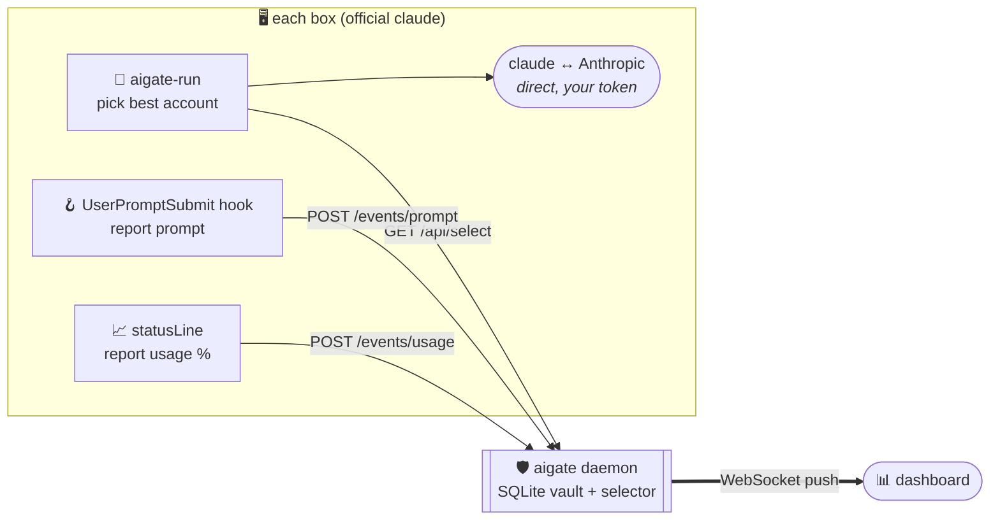
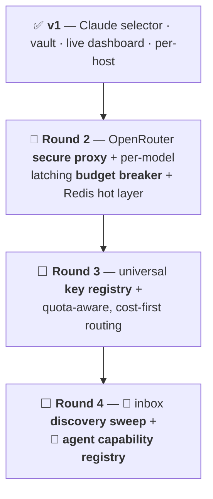

<div align="center">

# 🛡️ aigate

### **AisPLB — the AI Secure Proxy & Load Balancer**

*One self-hosted place that holds every AI key you own, hands them out securely,
balances by **cost & headroom**, and shows you **live what's using what** — so nothing runs away at 2am.*


-lightgrey)


</div>

> [!NOTE]
> **Status:** **v1 is shipped and runs** — the daemon (vault + usage-aware Claude account
> selector + WebSocket dashboard + audited handouts) is real and deployed. The **secure
> proxy for API-key providers**, **per-model budget breaker**, and **agent capability
> registry** are the roadmap → see **[VISION.md](VISION.md)**. Nothing below is vaporware; the
> ⬜ rows just aren't built yet.

Built by someone who woke up to a **$500 OpenRouter bill** from a rogue loop and had **no
idea which of 35 machines did it.** aigate is the tool that would've caught it at 2am.

---

## 🧭 Contents

| | | |
|---|---|---|
| [🤔 Why](#-why-not-just-a-proxy) | [🧠 Concepts](#-core-concepts) | [🏗️ Architecture](#️-architecture) |
| [🔁 How it works](#-how-it-works) | [✨ Features](#-features-v1) | [🚀 Quick start](#-quick-start) |
| [🔌 Wire up a box](#-wire-up-a-box-client-side) | [📡 API](#-api-reference) | [⚙️ Config](#️-config) |
| [🗺️ Roadmap](#️-roadmap) | [🔒 Security](#-security) | [🤝 Contributing](#-contributing) |

---

## 🤔 Why (not just a proxy?)

Multiple Claude Max subscriptions are **not against ToS** — [Anthropic's Claude Code team said
so](https://github.com/anthropics/claude-code/issues/54464). What gets accounts **banned** is
relaying/reselling tokens through a proxy that impersonates the client. aigate stays on the
**accepted** side of that line for Claude, and uses a normal secure proxy only where it's safe:

| Provider type | aigate mode | In Anthropic's request path? | Safe? |
|---|---|---|---|
| **Claude subscriptions** (OAuth) | 🎯 **Selector** — runs the *official* `claude` binary with the best account's token, records via local **hooks** | ❌ never | ✅ accepted architecture |
| **API-key providers** (OpenRouter, Perplexity, Fireworks, OpenAI…) | 🔀 **Secure proxy** — injects the real key, forwards, meters spend *(roadmap)* | ✅ (standard) | ✅ normal for API keys |

**Clients only ever hold an aigate token — never a raw provider key.** 🔐

---

## 🧠 Core concepts

```mermaid
mindmap
  root(("🛡️ aigate"))
    🔐 Vault
      AES-256-GCM at rest
      clients hold aigate token only
    ⚖️ Selection
      most headroom first
      cost-aware _(roadmap)_
    🧾 Audit
      every handout - IP + host
      every prompt - via hooks
    📊 Live
      WebSocket dashboard
      per-host / per-device
      🚨 runaway
    🛑 Guards _(roadmap)_
      per model x key caps
      latching breaker
```

---

## 🏗️ Architecture

**No proxy in Anthropic's path** — the daemon only *picks* the account and *records* activity
(via Claude Code's local hooks). The official client talks to Anthropic directly.



---

## 🔁 How it works

```mermaid
sequenceDiagram
  autonumber
  participant Box as 🖥️ box
  participant AG as 🛡️ aigate
  participant AN as 🤖 Anthropic
  Box->>AG: GET /api/select?host=pi-17
  AG->>AG: ORDER BY max(5h%,weekly%) ASC LIMIT 1
  AG-->>Box: { account, setup_token }  📝 (logs access + IP)
  Box->>AN: run OFFICIAL claude w/ token 🔑
  Box->>AG: 🪝 hook → POST prompt {host, cwd, model}
  Box->>AG: 📈 statusLine → POST usage {5h%, weekly%}
  AG-->>AG: 📊 broadcast() → dashboard lights up 🟢
```

---

## ✨ Features (v1)

| | Feature | Notes |
|---|---|---|
| 🔐 | **Encrypted token vault** | AES-256-GCM at rest; tokens are write-only via the API |
| ⚖️ | **Usage-aware selection** | hands out the account with the **most headroom** — lowest of `max(5h%, weekly%)`, skips any past the cutoff |
| 🧾 | **Full audit trail** | every token handout logged with **timestamp + source IP + host**; every prompt logged (account, host, cwd) |
| 📊 | **Live WebSocket dashboard** | account cards w/ usage bars (🚨 runaway), streaming activity feed, **per-host/device stats** |
| 🎯 | **No-proxy Claude mode** | official binary + hooks — won't flag accounts |
| 🐳 | **1 runtime dep** | `ws`. SQLite is Node's built-in `node:sqlite`. Buildless. Docker-ready. |

---

## 🚀 Quick start

```bash
git clone https://github.com/shoemoney/aigate && cd aigate
cp .env.example .env
#   → set AIGATE_TOKEN  (any long random string)
#   → set AIGATE_ENCRYPTION_KEY=$(openssl rand -hex 32)
npm install          # installs ws
npm start            # → http://localhost:20200
```

🐳 **Docker:** `docker compose up -d`

Open the dashboard, paste your `AIGATE_TOKEN`, then add accounts:

```bash
curl -X POST http://localhost:20200/api/accounts \
  -H "Authorization: Bearer $AIGATE_TOKEN" -H 'content-type: application/json' \
  -d '{"account":"max_1","setup_token":"sk-ant-oat01-…","label":"personal"}'
```
> 💡 Get each token with `claude setup-token` while logged into that account.

---

## 🔌 Wire up a box (client side)

<details>
<summary><b>3 files → 3 env vars → done</b></summary>

```bash
mkdir -p ~/.claude/aigate && cp clients/*.sh ~/.claude/aigate/
export AIGATE_URL=https://aigate.example.com AIGATE_TOKEN=…

# launch via the router so the account is chosen by headroom:
alias cc='bash ~/.claude/aigate/aigate-run.sh'
```

Register the reporters in `~/.claude/settings.json` (snippets are in each file):

| Script | Hook | Reports |
|---|---|---|
| `aigate-run.sh` | *(wrapper)* | picks account → runs official `claude` |
| `prompt-hook.sh` | `UserPromptSubmit` | prompt · host · cwd · model |
| `statusline-feed.sh` | `statusLine` | this account's 5h% + weekly% |

**No proxy, no token relay — the reporters run locally on the official client.**
</details>

---

## 📡 API reference

All endpoints require `Authorization: Bearer $AIGATE_TOKEN`.

| Method | Path | Purpose |
|---|---|---|
| `GET` | `/api/select?host=` | 🎯 best account + token (logs access w/ IP) |
| `GET` | `/api/accounts` | list accounts (usage + metadata, **no tokens**) |
| `POST` | `/api/accounts` | add/update `{account, setup_token, label}` |
| `DELETE` | `/api/accounts/:name` | remove |
| `POST` | `/api/accounts/:name/disabled` | `{disabled: true/false}` |
| `POST` | `/api/events/prompt` | 🪝 log a prompt (from the hook) |
| `POST` | `/api/events/usage` | 📈 update an account's 5h/weekly % |
| `GET` | `/api/logs?limit=` | recent prompt log |
| `GET` | `/api/stats` | dashboard rollups (by account + by host) |
| `WS` | `/ws?token=` | 📡 live event stream |

---

## ⚙️ Config

| Env var | Default | Purpose |
|---|---|---|
| `AIGATE_TOKEN` | — *(required)* | bearer token gating API + dashboard |
| `AIGATE_ENCRYPTION_KEY` | — *(required)* | 32-byte hex (AES-256-GCM). `openssl rand -hex 32` |
| `PORT` | `20200` | HTTP port |
| `HOST` | `0.0.0.0` | bind host |
| `AIGATE_DB` | `./data/aigate.db` | SQLite path |
| `AIGATE_HEADROOM_CUTOFF` | `95` | skip accounts whose worst-window % ≥ this |

---

## 🗺️ Roadmap

Every ring is born from a **real** frustration — the full story lives in **[VISION.md](VISION.md)**.



| Ring | Ships | Kills the pain of… |
|---|---|---|
| ✅ **v1** | Claude account selector · encrypted vault · WS dashboard · per-host audit | "which of my 35 boxes is that?" |
| 🔨 **R2** | secure proxy for API providers · **per-`model×key` latching budget breaker** · Redis (TTL counters + pub/sub) | the **$500 nano-banana loop** |
| ⬜ **R3** | `keys(provider)` registry · usage pollers · **cost-first routing** (included quota → prepaid → paid) | paying twice for quota you already own |
| ⬜ **R4** | inbox account discovery · `GET /capabilities` for agents | keys too annoying to use → agents just use them |

> 🔨 = the one "next" pointer. Nothing gets a ✅ until it exists in code and runs for real.

---

## 🔒 Security

- 🔑 Tokens **AES-256-GCM** encrypted at rest; clients hold only the aigate bearer token.
- 🧾 Every handout is **audited** (account · host · IP · timestamp).
- 🧯 `.env` is git-ignored; **never** commit real tokens/keys.
- ⚖️ **Personal, honest, visible.** Multiple *personal* subs via the official client is fine —
  pooling/reselling access for others is not. aigate gives you the visibility to stay honest.

---

## 🤝 Contributing

PRs welcome! 💜 This is early and opinionated — read **[VISION.md](VISION.md)** first so a PR
lands in the right ring. Keep the **no-relay-for-Claude** guardrail sacred.

```bash
npm start           # daemon
node --watch src/server.js   # hot reload
```

## 📜 License

MIT © shoemoney — do whatever, just don't get people's accounts banned. 🛡️

---

<div align="center">

**Born from a "damn ADHD, what was that tool called?" moment.** 🧠⚡
*If it saves you one $500 morning, it paid for itself infinitely (it's free).* 😄

`included quota → prepaid → paid` · never the other way around

</div>
