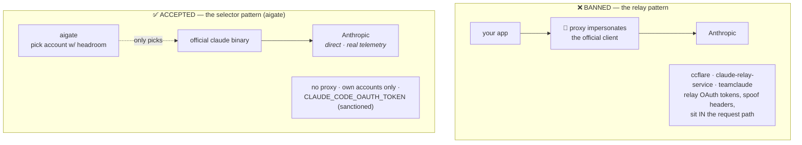
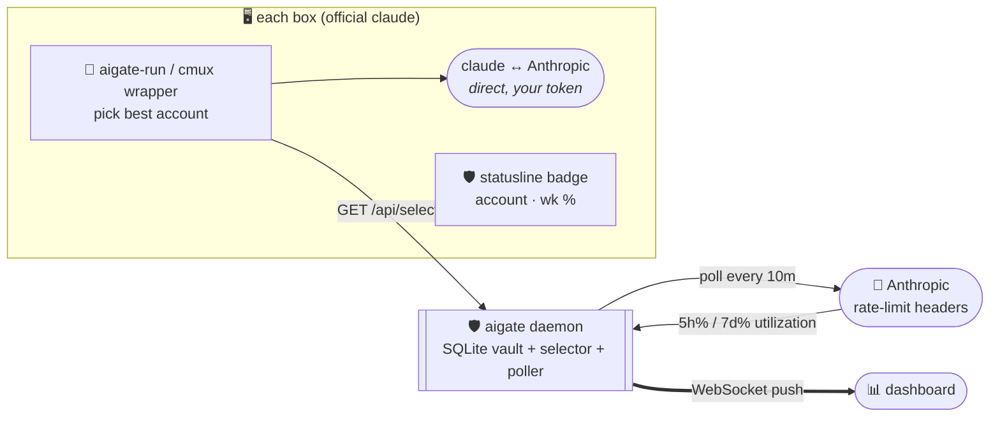
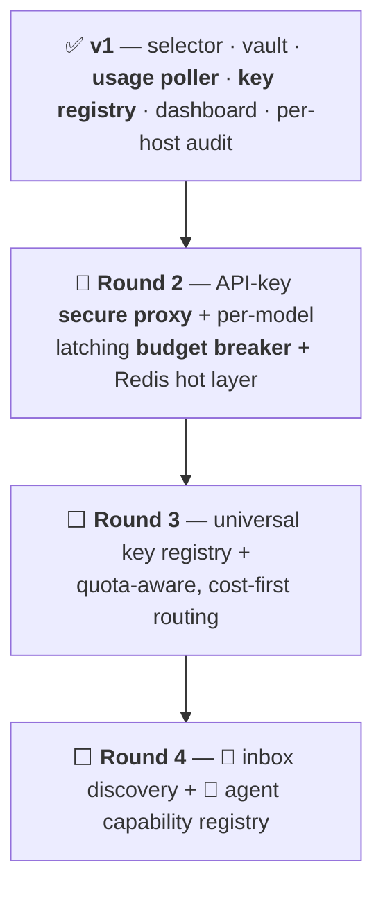

<div align="center">

# 🛡️ aigate

### **The AI Secure Proxy & Load Balancer**

*One self-hosted place that holds every AI credential you own, hands them out **the compliant way**, balances by **real rate-limit headroom**, and shows you **live what's using what** — so nothing runs away at 2am.*


-lightgrey)


</div>

---

<div align="center">

## 💛 Shoutout to Theo

**This one's for [Theo Browne](https://t3.gg) — [@t3dotgg](https://x.com/theo).**

If you found this repo through his channel: **welcome in.** 🎬 I build the way I build because of people who make it fun to watch someone care about their craft — and Theo is at the top of that list. The bias for shipping, the "just self-host it," the allergy to over-engineered nonsense — a lot of that rubbed off from years of his videos. **Thank you, genuinely. I owe you a ton.** 🙏

[🌐 t3.gg](https://t3.gg) · [💬 t3.chat](https://t3.chat) · [▶️ YouTube](https://youtube.com/@t3dotgg) · [🐦 @theo](https://x.com/theo) · [⚡ create.t3.gg](https://create.t3.gg) · [📦 UploadThing](https://uploadthing.com)

</div>

---

> [!NOTE]
> **Status: v1 shipped, fleet-verified.** The daemon — encrypted vault, **headroom-aware Claude account selector**, **server-side usage poller**, **provider-key registry**, WebSocket dashboard, full audit — is real and running on live machines. The **secure proxy for API-key providers** and **latching budget breaker** are the roadmap → see **[VISION.md](VISION.md)**. Nothing below is vaporware; the ⬜ rows just aren't built yet.

Built by someone who woke up to a **$500 OpenRouter bill** from a rogue loop and had **no idea which of 35 machines did it.** aigate is the tool that would've caught it at 2am. 😴💸

---

## 🧭 Contents

| | | |
|---|---|---|
| [🤔 Why](#-why-not-just-a-proxy) | [⚖️ Compliance](#️-compliance-the-whole-point) | [🧠 Concepts](#-core-concepts) |
| [🏗️ Architecture](#️-architecture) | [🔁 How it works](#-how-it-works) | [✨ Features](#-features-v1) |
| [🚀 Quick start](#-quick-start) | [🔌 Wire up a box](#-wire-up-a-box-client-side) | [🧪 Prove it switches](#-prove-it-actually-switches) |
| [📡 API](#-api-reference) | [⚙️ Config](#️-config) | [🗺️ Roadmap](#️-roadmap) |

---

## 🤔 Why (not just a proxy?)

Multiple Claude Max subscriptions are **not against ToS** — [Anthropic's Claude Code team said so](https://code.claude.com/docs/en/legal-and-compliance). What gets accounts **banned** is relaying/reselling tokens through a proxy that impersonates the official client. aigate stays firmly on the **accepted** side of that line for Claude, and uses a normal secure proxy only where it's safe:

| Provider type | aigate mode | In Anthropic's request path? | Safe? |
|---|---|---|---|
| **Claude subscriptions** (OAuth) | 🎯 **Selector** — runs the *official* `claude` binary with the best account's token | ❌ **never** | ✅ accepted architecture |
| **API-key providers** (OpenRouter, OpenAI, Gemini…) | 🔀 **Secure proxy** — injects the real key, meters spend *(roadmap)* | ✅ (standard) | ✅ normal for API keys |

**Clients only ever hold an aigate token — never a raw provider key.** 🔐

---

## ⚖️ Compliance (the whole point)

> Most "multi-account Claude" tools get this **wrong** and get people banned. aigate is built specifically to get it **right.** Here's the line, in Anthropic's own words, and where every tool falls.

Anthropic's [Claude Code legal & compliance page](https://code.claude.com/docs/en/legal-and-compliance) is unusually explicit. The banned pattern is **routing requests through Free/Pro/Max plan credentials on behalf of users** via a proxy that impersonates the official client. Running **your own** multiple accounts is fine — Claude Code team member Thariq Shihipar: *"It's not against terms of service to have multiple MAX accounts."*



**Three tests aigate passes:**

| Test | Banned tools | aigate |
|---|---|---|
| **Who makes the request?** | a proxy spoofing the client | the **official `claude` binary** ✅ |
| **Whose accounts?** | routes on behalf of *other users* / resells | **only your own** ✅ |
| **Evading limits?** | sticky sessions *designed* to dodge caps | picks headroom for *ordinary individual use* ✅ |

> [!WARNING]
> **The one soft spot — respect it.** Keep aigate **single-tenant** and each account's usage within *ordinary individual* bounds. Do **not** shard one heavy 24/7 workload across N accounts to beat the weekly cap — that's *limit evasion*, bannable even with the official binary. Prefer an **API-key fallback** (Console pay-go) over over-draining a subscription. Never ship a token to a machine used by a different person.

---

## 🧠 Core concepts

```mermaid
mindmap
  root(("🛡️ aigate"))
    🔐 Vault
      AES-256-GCM at rest
      Claude OAuth tokens
      provider API keys
      clients hold aigate token only
    ⚖️ Selection
      most headroom first
      auto-skip ≥95%
      auto-recover after reset
    📈 Usage poller
      reads Anthropic rate-limit headers
      every 10 min · no proxy
      per-account 5h + 7d %
    🧾 Audit
      every handout - IP + host
      every prompt - via hooks
    📊 Live
      WebSocket dashboard
      🚨 runaway detection
    🛑 Guards _(roadmap)_
      per model x key caps
      latching breaker
```

---

## 🏗️ Architecture

**No proxy in Anthropic's path.** The daemon only *picks* the account, *records* activity, and *polls* real usage. The official client talks to Anthropic directly.



---

## 🔁 How it works

```mermaid
sequenceDiagram
  autonumber
  participant Box as 🖥️ box
  participant AG as 🛡️ aigate
  participant AN as 🤖 Anthropic
  Note over AG,AN: every 10 min, per account
  AG->>AN: tiny call w/ account's token
  AN-->>AG: anthropic-ratelimit-unified-{5h,7d}-utilization
  AG->>AG: write real usage → auto-skip ≥95%
  Note over Box,AN: on demand
  Box->>AG: GET /api/select?host=pi-17
  AG->>AG: ORDER BY max(5h%,7d%) ASC, skip disabled/over-cutoff
  AG-->>Box: { account, setup_token }  📝 (logs access + IP)
  Box->>AN: run OFFICIAL claude w/ token 🔑
```

---

## ✨ Features (v1)

| | Feature | Notes |
|---|---|---|
| 🔐 | **Encrypted vault** | AES-256-GCM at rest — Claude OAuth tokens **and** provider API keys; tokens are write-only via the API |
| ⚖️ | **Headroom-aware selection** | hands out the account with the **most headroom** (lowest of `max(5h%,7d%)`), skips anything ≥ cutoff |
| 📈 | **Server-side usage poller** | reads each account's **real** rate-limit headroom straight from Anthropic every 10 min → auto-skip maxed, **auto-recover after reset**, zero manual seeding |
| 🔑 | **Provider-key registry** | encrypted store + `/api/keys` for OpenAI / OpenRouter / Anthropic / Gemini / Perplexity / … — validated keys in one place |
| 🧾 | **Full audit trail** | every handout logged with **timestamp + IP + host**; every prompt logged (account, host, cwd) |
| 📊 | **Live dashboard** | account cards w/ usage bars (🚨 runaway), streaming activity feed, per-host/device stats |
| 🎯 | **No-proxy Claude mode** | official binary + wrappers — won't flag accounts |
| 🐳 | **1 runtime dep** | `ws`. SQLite is Node's built-in `node:sqlite`. Buildless. Docker-ready. |

---

## 🚀 Quick start

```bash
git clone https://github.com/shoemoney/aigate && cd aigate
cp .env.example .env
#   → set AIGATE_TOKEN  (any long random string)
#   → set AIGATE_ENCRYPTION_KEY=$(openssl rand -hex 32)
npm install          # installs ws
npm start            # → http://localhost:20200
```

🐳 **Docker:** `docker compose up -d`

Add a Claude account (mint the token with `claude setup-token` while logged into that account):

```bash
curl -X POST http://localhost:20200/api/accounts \
  -H "Authorization: Bearer $AIGATE_TOKEN" -H 'content-type: application/json' \
  -d '{"account":"max_1","setup_token":"sk-ant-oat01-…","label":"personal"}'
```

<details>
<summary>💡 <b>The <code>setup-token</code> gotcha that trips everyone</b></summary>

`claude setup-token` shows **two** screens. The browser **"Authentication Code"** page (`code#state`, *"Paste this into Claude Code"*) is **not** the token — it goes back into the waiting terminal, which then prints the real **`sk-ant-oat01-…`**. *That* line is what aigate stores.
</details>

Add a provider key:

```bash
curl -X POST http://localhost:20200/api/keys \
  -H "Authorization: Bearer $AIGATE_TOKEN" -H 'content-type: application/json' \
  -d '{"provider":"openrouter","key":"sk-or-v1-…","label":"prod"}'
```

---

## 🔌 Wire up a box (client side)

<details>
<summary><b>Drop 4 files → source one line → done</b></summary>

```bash
mkdir -p ~/.claude/aigate && cp clients/*.sh ~/.claude/aigate/
printf "export AIGATE_URL='https://aigate.example.com'\nexport AIGATE_TOKEN='…'\n" > ~/.claude/aigate/env
chmod 600 ~/.claude/aigate/env
echo '[ -f ~/.claude/aigate/cc.zsh ] && source ~/.claude/aigate/cc.zsh' >> ~/.zshrc
```

Now `cc` launches Claude Code on the account with the most headroom, and **unsets any stray `ANTHROPIC_API_KEY`** so nothing silently bypasses the selector.

| File | Role |
|---|---|
| `aigate-run.sh` | the `cc` wrapper — select → set token → unset stray key → exec official `claude` |
| `cmux-claude.sh` | same, for the [cmux](https://github.com/manaflow-ai/cmux) terminal (`automation.claudeBinaryPath`) |
| `cc.zsh` | defines the `cc` shell function |
| `test-cc.sh` | one-shot end-to-end router test |

> [!TIP]
> **Using cmux?** It caches `claudeBinaryPath` at launch — point it at `cmux-claude.sh` and do a full **Cmd+Q relaunch**, not just a new window.
>
> **"Unable to connect to API"?** Grep `~/.claude/settings*.json` for a stale `ANTHROPIC_BASE_URL` (e.g. a dead `127.0.0.1:8787` proxy) and strip it — it silently hijacks every request.
</details>

---

## 🧪 Prove it actually switches

Don't trust a router you haven't watched fail. Flip the DB and confirm it errors:

```bash
# 1. disable the good account, make the maxed one selectable
curl -X POST $URL/api/accounts/personal/disabled -H "$AUTH" -d '{"disabled":true}'
# 2. run the test → EXPECT the weekly-limit error (proves it switched)
~/.claude/aigate/test-cc.sh        # → "You've hit your weekly limit …"
# 3. restore
curl -X POST $URL/api/accounts/personal/disabled -H "$AUTH" -d '{"disabled":false}'
```

If it errors on the maxed account and works on the good one, your router is real. ✅

---

## 📡 API reference

All endpoints require `Authorization: Bearer $AIGATE_TOKEN`.

| Method | Path | Purpose |
|---|---|---|
| `GET` | `/api/select?host=` | 🎯 best account + token (logs access w/ IP) |
| `GET` / `POST` | `/api/accounts` | list (usage, **no tokens**) / add `{account, setup_token, label}` |
| `DELETE` | `/api/accounts/:name` | remove |
| `POST` | `/api/accounts/:name/disabled` | `{disabled: true/false}` |
| `POST` | `/api/events/usage` | 📈 set an account's 5h/7d % (the poller writes this) |
| `GET` / `POST` | `/api/keys` | list (**no secrets**) / add `{provider, key, label}` |
| `DELETE` | `/api/keys/:id` | remove a provider key |
| `GET` | `/api/logs?limit=` · `/api/stats` | prompt log · dashboard rollups |
| `WS` | `/ws?token=` | 📡 live event stream |

---

## ⚙️ Config

| Env var | Default | Purpose |
|---|---|---|
| `AIGATE_TOKEN` | — *(required)* | bearer gating API + dashboard |
| `AIGATE_ENCRYPTION_KEY` | — *(required)* | 32-byte hex (AES-256-GCM). `openssl rand -hex 32` |
| `PORT` / `HOST` | `20200` / `0.0.0.0` | bind |
| `AIGATE_DB` | `./data/aigate.db` | SQLite path |
| `AIGATE_HEADROOM_CUTOFF` | `95` | skip accounts whose worst-window % ≥ this |
| `AIGATE_POLL_MS` | `600000` | usage-poll interval (ms); `0` disables the poller |
| `AIGATE_ALLOW_CIDR` | *(empty = all)* | 🌐 network gate — CIDRs + single IPs. Loopback always OK. |

---

## 🗺️ Roadmap



| Ring | Ships | Kills the pain of… |
|---|---|---|
| ✅ **v1** | headroom selector · encrypted vault · **10-min usage poller** · **provider-key registry** · WS dashboard | "which of my 35 boxes is that?" + manual usage babysitting |
| 🔨 **R2** | secure proxy for API providers · per-`model×key` **latching budget breaker** · Redis | the **$500 nano-banana loop** |
| ⬜ **R3** | universal `keys(provider)` registry · **cost-first routing** (included quota → prepaid → paid) | paying twice for quota you already own |
| ⬜ **R4** | inbox account discovery · `GET /capabilities` for agents | keys too annoying to use → agents just use them |

> 🔨 = the one "next" pointer. Nothing gets a ✅ until it exists in code and runs on real machines.

---

## 🔒 Security

- 🔑 Credentials **AES-256-GCM** encrypted at rest; clients hold only the aigate bearer.
- 🧾 Every handout **audited** (account · host · IP · timestamp).
- 🧯 `.env` is git-ignored; **never** commit real tokens/keys.
- ⚖️ **Personal, honest, visible.** Multiple *personal* subs via the official client is fine — pooling/reselling for others is not. aigate gives you the visibility to stay honest.

---

## 🤝 Contributing

PRs welcome! 💜 Early and opinionated — read **[VISION.md](VISION.md)** first so a PR lands in the right ring. Keep the **no-relay-for-Claude** guardrail sacred.

```bash
npm start                     # daemon
node --watch src/server.js    # hot reload
```

## 📜 License

MIT © shoemoney — do whatever, just don't get people's accounts banned. 🛡️

---

<div align="center">

**Born from a "damn ADHD, what was that tool called?" moment.** 🧠⚡
*If it saves you one $500 morning, it paid for itself infinitely (it's free).* 😄

Once more, for the person who made building look worth caring about — **thank you, [Theo](https://t3.gg).** 💛

`included quota → prepaid → paid` · never the other way around

</div>
