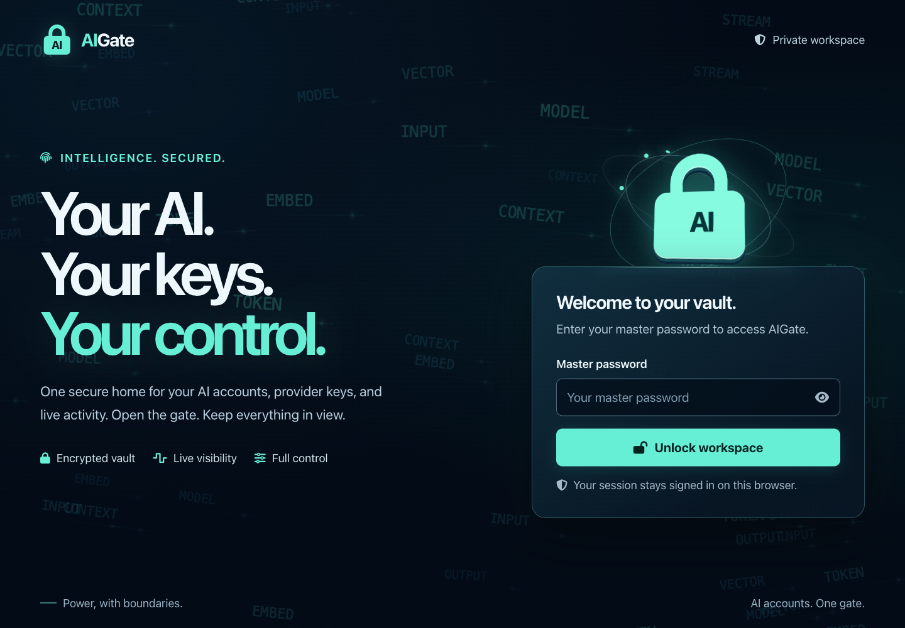
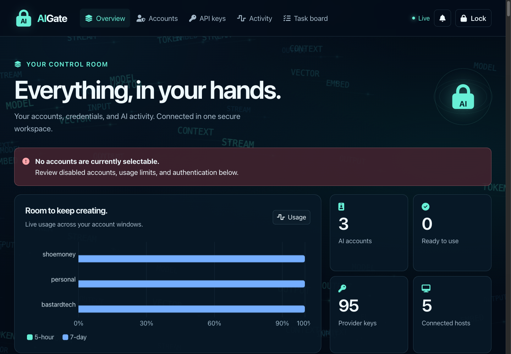
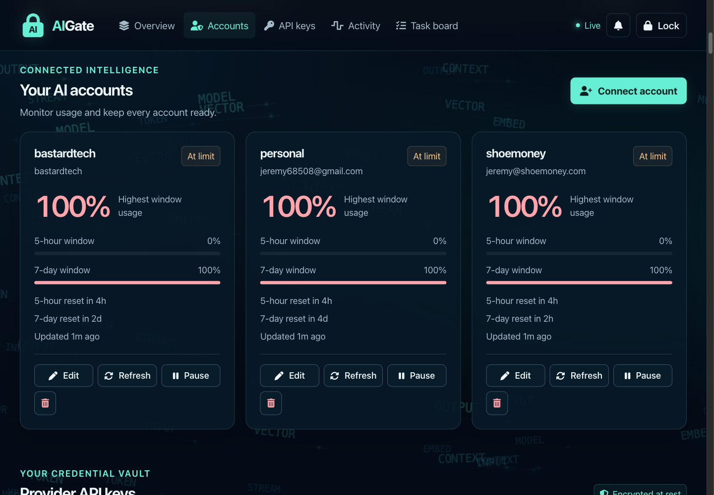
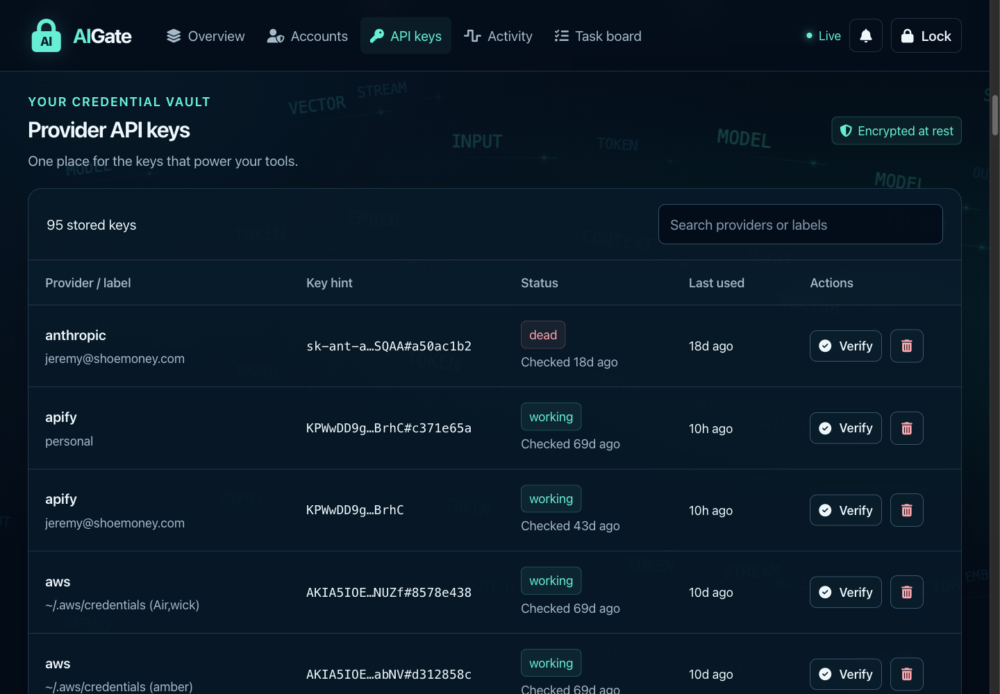
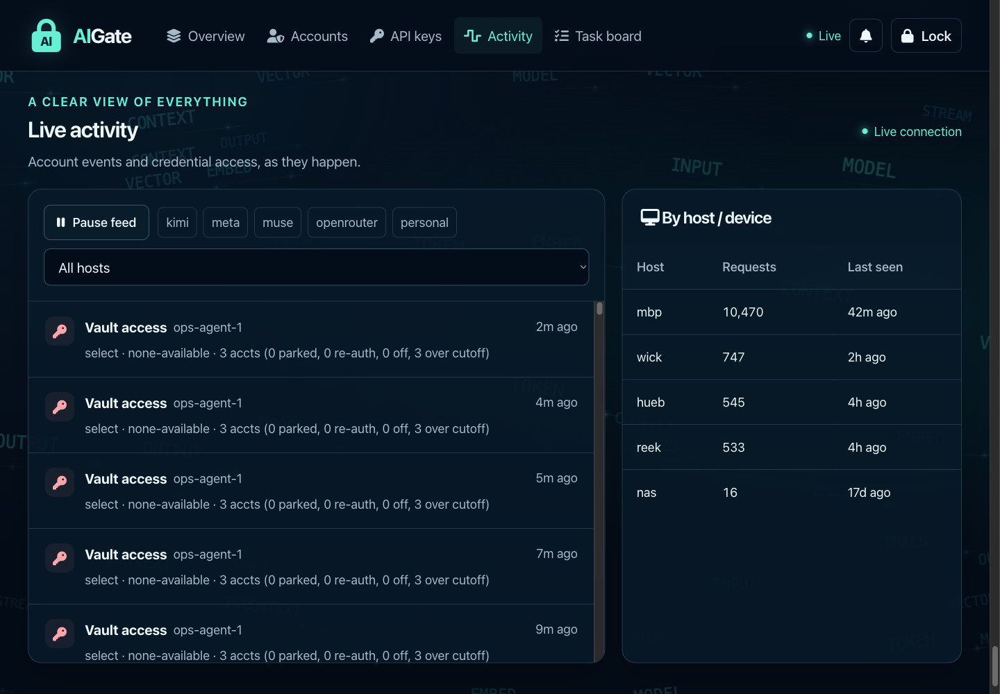
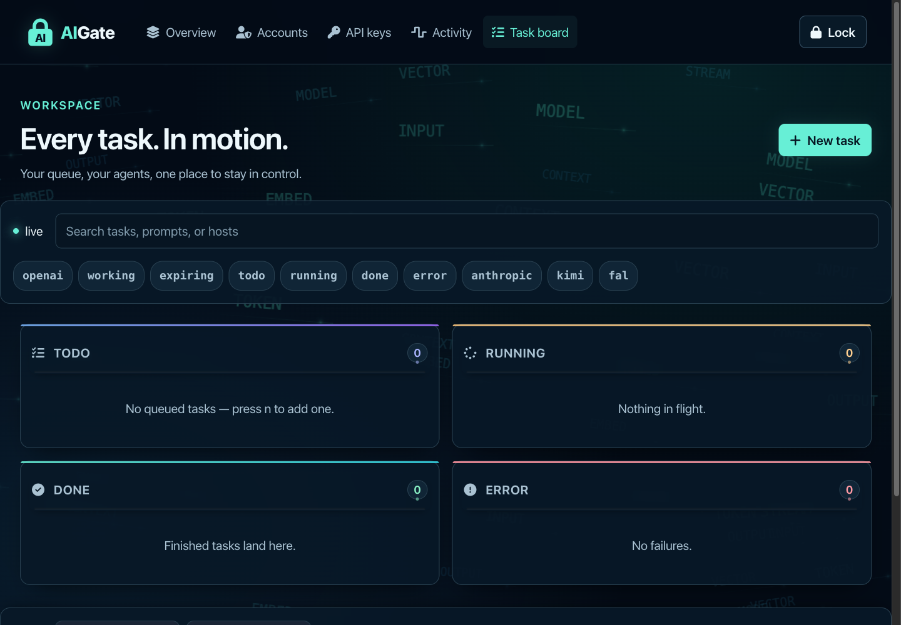
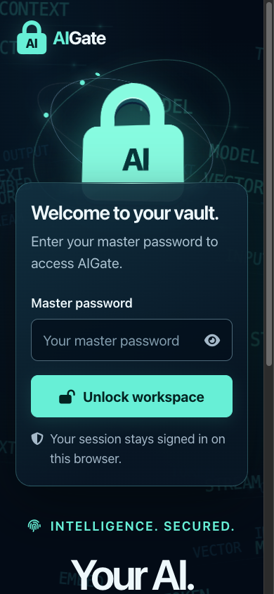
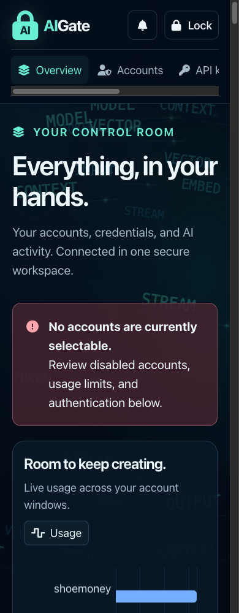
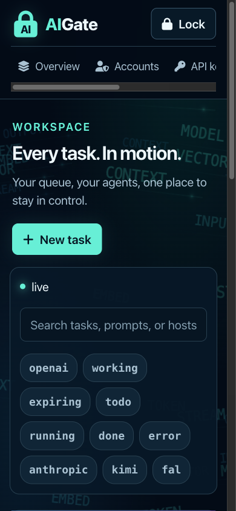
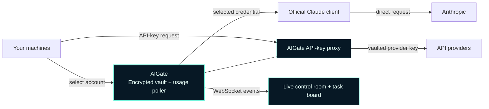

<div align="center">


# AIGate

### Your AI. Your keys. Your control.

**A self-hosted control room for AI credentials, account headroom, and machine activity.**

[Explore the interface](#screenshots) · [Quick start](#quick-start) · [Connect a machine](#connect-a-machine) · [API reference](#api-reference) · [Configuration](#configuration)

Node.js 24+ · SQLite · One runtime dependency · MIT

</div>

[](docs/screenshots/live-2026-09-15/01-entry-desktop.png)

**One vault. A clear view of what is using it.** AIGate stores your credentials, selects Claude accounts by available headroom, proxies requests for supported API-key providers, and brings usage and activity into one live workspace.

Claude subscription requests run through the official Claude client directly. API-key proxy requests use the provider-key vault. These are separate paths; see [credential boundaries](#credential-boundaries).

| Vault | Observe | Operate |
|---|---|---|
| Encrypted account credentials and provider keys, with audited retrieval. | Real usage charts, account limits, connected machines, and streaming activity. | Headroom-aware selection, API-key routing, and a live task board. |

## Screenshots

Captured from the deployed application on **September 15, 2026**. These are live states, including actual limit warnings and an empty task board. Click any screenshot to open the full-resolution PNG.

### The control room

Unlock once to reveal the top menu: **Overview · Accounts · API keys · Activity · Task board**. The master-password entry page stays focused on access, without workspace navigation.

[](docs/screenshots/live-2026-09-15/03-control-room-desktop.png)

A shared WebGPU token field runs across the entry page, dashboard, and board. Live events trigger visual pulses; the ambient token words are decorative. Canvas 2D provides a fallback, reduced-motion preferences are respected, and animation pauses in hidden tabs. The screenshots capture a frame of that moving background.

<details>
<summary><strong>Accounts — headroom and availability</strong></summary>

### Know which account can work

Inspect usage, refresh headroom, and manage account availability from the same workspace.

[](docs/screenshots/live-2026-09-15/04-accounts-desktop.png)

</details>

<details>
<summary><strong>API keys — the provider vault</strong></summary>

### See what is stored and what is working

Browse provider keys with masked hints, status, and management controls. List responses do not expose complete secrets.

[](docs/screenshots/live-2026-09-15/05-api-keys-desktop.png)

</details>

<details>
<summary><strong>Activity — a live view across machines</strong></summary>

### Follow the work

Filter and pause the activity feed to inspect the events arriving from your machines.

[](docs/screenshots/live-2026-09-15/06-activity-desktop.png)

</details>

<details>
<summary><strong>Task board — queue, run, review</strong></summary>

### A shared board for agent work

Create tasks, track worker activity, and review results through TODO, RUNNING, DONE, and ERROR columns. The board API remains internal and unstable.

[](docs/screenshots/live-2026-09-15/07-task-board-desktop.png)

</details>

<details>
<summary><strong>Mobile — password entry, control room, and task board</strong></summary>

### Password entry

<a href="docs/screenshots/live-2026-09-15/02-entry-mobile.png"></a>

### Control room

<a href="docs/screenshots/live-2026-09-15/09-control-room-mobile.png"></a>

### Task board

<a href="docs/screenshots/live-2026-09-15/08-task-board-mobile.png"></a>

</details>

**[All screenshot files](docs/screenshots/live-2026-09-15/) · [Download the PNG collection](docs/screenshots/live-2026-09-15/aigate-live-screenshots.zip) · [Capture metadata](docs/screenshots/live-2026-09-15/capture-info.json)**

The folder also includes an [interactive gallery](docs/screenshots/live-2026-09-15/index.html) with thumbnails, favorites, full-size previews, and side-by-side comparison. Download or clone the repository and open that HTML file locally; GitHub displays its source. [Preview the gallery](docs/screenshots/live-2026-09-15/gallery-desktop.png).

## What ships

| Capability | Implemented behavior |
|---|---|
| **Encrypted vault** | AES-256-GCM storage for Claude account tokens and provider API keys. List endpoints return metadata; authenticated selection and key-fetch routes return the requested credential and record access. |
| **Account selection** | Ranks accounts by their worst usage window, skips disabled, parked, and over-cutoff accounts, and recovers eligibility as limits reset. The default cutoff is 95%. |
| **Usage polling** | Reads real five-hour and seven-day rate-limit utilization every ten minutes. Unchecked usage is shown as unknown rather than a fabricated zero. |
| **Provider registry** | A 65-provider catalog, add-key controls, bulk import, normalized key intake, liveness probes where supported, and masked key hints. |
| **API-key proxy** | Anthropic Messages, OpenAI Chat Completions, and Responses endpoints with provider routing, server-side key injection, streaming, and audited key failover. |
| **Claude client integration** | The `cc` wrapper runs the official binary, checks account headroom, parks exhausted accounts, and retries with the next eligible account. Global overload responses retry the same account. |
| **Live interface** | WebSocket updates, interactive usage charts, account and key management, a filtered activity feed, responsive navigation, and the shared token background. |
| **Task board** | Atomic task claims, worker heartbeats, drag reordering, results, follow-ups, and retries. Its API is internal and may change. |
| **Audit and recovery** | Credential access and mutations are logged; prompts are scrubbed before storage. DB-backed health checks, a watchdog, a boot encryption canary, and daily snapshots support operations. |
| **Verification** | **200 automated tests passed** for the September 15 release, including HTTP and client behavior checks. Desktop/mobile rendering and WebGPU were also checked in a browser. See [testing](docs/TESTING.md) and [UI implementation notes](docs/UI-REDESIGN.md). |
| **Small runtime** | Node.js 24+, built-in `node:sqlite`, and `ws` as the single runtime dependency. No frontend build step. |

## Architecture


```mermaid
flowchart LR
  Client["Your machines"] -->|"select account"| Vault["AIGate<br/>Encrypted vault + usage poller"]
  Vault -->|"selected credential"| Claude["Official Claude client"]
  Claude -->|"direct request"| Anthropic["Anthropic"]
  Client -->|"API-key request"| Proxy["AIGate API-key proxy"]
  Vault --- Proxy
  Proxy -->|"vaulted provider key"| Providers["API providers"]
  Vault -->|"WebSocket events"| UI["Live control room + task board"]
  style Vault fill:#071825,color:#e9fff9,stroke:#67efd6,stroke-width:2px
  style Proxy fill:#071825,color:#e9fff9,stroke:#67efd6
  style UI fill:#071825,color:#e9fff9,stroke:#67efd6
```

The daemon polls usage and records activity independently of Claude's request stream. The client requests an eligible account, then launches the official `claude` binary with that credential. Prompt hooks re-check headroom and record activity; a genuine account-limit response can park the account temporarily and continue on the next eligible account.

For API-key requests, AIGate is in the request path: it selects a working provider key, injects it server-side, and streams the upstream response. The supported routes and model mappings are documented in the [API reference](#api-reference).

### Credential boundaries

Claude OAuth setup tokens belong in **accounts**. Provider API keys belong in **provider_keys**. The proxy reads the provider-key vault and rejects Claude setup tokens at intake and retrieval. The selector returns credentials to authenticated callers, so clients using selection or explicit key retrieval do receive those credentials; proxy clients use the AIGate bearer instead.

For the project's policy analysis and source references, read [COMPLIANCE.md](COMPLIANCE.md). The software's routing architecture does not guarantee an account's policy status.

### Task lifecycle

Create a card with `POST /api/board`. A worker claims it atomically with `POST /api/board/claim`, sends `/api/board/activity` heartbeats, and posts a result to move it into DONE or ERROR. Follow-up and retry operations re-queue work. The UI combines WebSocket updates with worker polling; stale workers are pruned after five minutes.

---

## Quick start

```bash
git clone https://github.com/shoemoney/aigate && cd aigate
cp .env.example .env
# Edit .env and set:
# AIGATE_TOKEN: a long random bearer token
# AIGATE_ENCRYPTION_KEY: the output of openssl rand -hex 32
# AIGATE_DASHBOARD_PASSWORD: your master password
npm install          # installs ws
npm start            # http://localhost:20200
```

 **Requires Node.js 24 or newer.** Open [localhost:20200](http://localhost:20200) and unlock with your master password.

**Docker:** `docker compose up -d`

Add a Claude account (mint the token with `claude setup-token` while logged into that account):

```bash
curl -X POST http://localhost:20200/api/accounts \
  -H "Authorization: Bearer $AIGATE_TOKEN" -H 'content-type: application/json' \
  -d '{"account":"max_1","setup_token":"sk-ant-oat01-…","label":"personal"}'
```

<details>
<summary><b>The <code>setup-token</code> gotcha that trips everyone</b></summary>

`claude setup-token` shows **two** screens. The browser **"Authentication Code"** page (`code#state`, *"Paste this into Claude Code"*) is **not** the token — it goes back into the waiting terminal, which then prints the real **`sk-ant-oat01-…`**. *That* line is what aigate stores.
</details>

Add a provider key:

```bash
curl -X POST http://localhost:20200/api/keys \
  -H "Authorization: Bearer $AIGATE_TOKEN" -H 'content-type: application/json' \
  -d '{"provider":"openrouter","key":"sk-or-v1-…","label":"prod"}'
```

You can also open **API keys** in the dashboard, choose a provider, and add the key. The server trims quoted pastes and rejects accidental `export NAME=…` assignments with a `400` response.

---

## Connect a machine

**One installer sets up the `cc` command.** It routes the official `claude`
through aigate's selector, unsets stray `ANTHROPIC_API_KEY` / `ANTHROPIC_AUTH_TOKEN` /
`ANTHROPIC_BASE_URL`, preflight-**warns** on shadow logins + `BASE_URL` hijacks, and (in
headless `-p` mode) detects over-limit and retries the next account — with **clean stdout**
(all banners on stderr, so piping `cc -p` output stays pure).

```bash
AIGATE_URL='https://aigate.example.com' AIGATE_TOKEN='…' bash clients/install.sh
cc -p 'hi'          # Claude replies using the account with the most headroom
```

The installer writes `~/.claude/aigate/{aigate-run.sh,hydrate.sh,env}` + `~/.local/bin/cc`
and auto-detects the `claude` binary.

> [!IMPORTANT]
> The **live copies are `~/.claude/aigate/*`** — editing `clients/*.sh` in the repo changes
> nothing on a box until you **re-run `clients/install.sh` there**. Ship client-script
> changes by re-running the installer on each machine.

| File | Role |
|---|---|
| `install.sh` | sets up `cc` + `~/.claude/aigate/` + env; auto-detects `claude`; wires MCP-key hydration into the shell |
| `aigate-run.sh` | the `cc` wrapper — select → set token → unset stray `ANTHROPIC_*` (incl. `BASE_URL`) → run `claude`; **interactive sessions auto-switch** on exhaustion — relaunch `claude --continue` on the next account, **no `[Y/n]`**, same conversation; **retry-on-limit** in `-p` mode (real limit → **15m park** + next account; transient **529 → wait 10s, retry the SAME account, no park**) w/ clean stdout; preflight-warns **shadow logins** + `BASE_URL` hijacks |
| `aigate-kimi.sh` | **[Kimi K3 only]** — run the official `claude` binary against Kimi's Anthropic-compatible endpoint; fetches the `sk-kimi` key from the vault (audited, host+IP); atomic-writes a cache (mode 600) so parallel swarms survive vault blips; maps every model tier onto Kimi; adds `--dangerously-skip-permissions` in `-p` headless mode; bypasses the Claude-account warden (Kimi has no OAuth) but **stays a selector** — still the real binary, your own vaulted key, **never a proxy** |
| `hydrate.sh` | MCP-key hydration — vault → `~/.claude/aigate/mcp-keys.env` so `${BRAVE_API_KEY}`-style MCP configs resolve at launch; **merges** partial fetches (a blip never wipes cached keys); `cc` **foreground-freshens** when missing/stale (>12h) so *this* launch gets keys |
| `prompt-hook.sh` | Claude Code `UserPromptSubmit` hook → **re-evaluates the current account every turn** (parks it fleet-wide the instant it's exhausted) + logs the prompt; backgrounded & **stdio-detached** = does not block the prompt turn |
| `statusline-feed.sh` | statusline badge (account · wk %) → also feeds real usage back |
| `test-switching.sh` | end-to-end switching test (below) |

### `/add-key` — teach every Claude to use the key vault

The repo includes a Claude Code **skill** at [`.claude/skills/add-key/`](.claude/skills/add-key/SKILL.md). Any Claude working in this repo (or with the skill synced into `~/.claude/skills/`) can type **`/add-key`** to vault a provider key and fetch it back to *use* it — no hardcoded secrets:

```text
/add-key        → store an OpenAI/fal/Gemini/… key, list what's vaulted,
                  or pull a key at runtime (GET /api/keys/:provider)
```

It knows the auth flow (source `~/.claude/aigate/env`), the 65-provider catalog, and the add / list / fetch / rotate routes. Distribute it fleet-wide by dropping it in `~/.claude/skills/` on each box — every Claude then knows how to reach the vault.

> [!TIP]
> `cc` is a shell command (`~/.local/bin/cc`). On Linux it shadows the C
> compiler `cc` when `~/.local/bin` precedes `/usr/bin` — rename it if you
> compile with `cc`. In headless `-p` mode it auto-adds
> `--dangerously-skip-permissions` so it never hangs on the trust prompt.
>
> **"Unable to connect to API"?** A stale `ANTHROPIC_BASE_URL` silently hijacks
> every request. `cc` unsets the env var and **preflight-warns** when
> `~/.claude/settings*.json` carries one — strip the key where it points.

### `cc kimi` — Kimi K3 via aigate

Kimi K3 ("Kimi for Coding") has an Anthropic-compatible API endpoint. To run the official `claude` binary against Kimi:

```bash
cc kimi [claude args...]
cc kimi -p "explain this repo"
```

**How it works:** `cc` dispatches `kimi` to `aigate-kimi.sh`, which fetches your vaulted `sk-kimi` key from aigate, points `ANTHROPIC_BASE_URL` and `ANTHROPIC_AUTH_TOKEN` at Kimi's endpoint, maps every model tier to Kimi, and runs the real `claude` binary. The architecture stays a **selector** — your own key, the real binary, never a proxy relaying requests through aigate. Kimi has no Claude OAuth account, so this bypasses the multi-account warden entirely.

**Setup:**

1. **Vault the Kimi key.** Use `/add-key` or curl:
   ```bash
   curl -X POST http://localhost:20200/api/keys \
     -H "Authorization: Bearer $AIGATE_TOKEN" -H 'content-type: application/json' \
     -d '{"provider":"kimi","key":"sk-…","label":"kimi-k3"}'
   ```
2. **Re-run the installer** on any box where you want `cc kimi`:
   ```bash
   AIGATE_URL='https://aigate.example.com' AIGATE_TOKEN='…' bash clients/install.sh
   ```
   The installer now installs both `aigate-run.sh` and `aigate-kimi.sh` alongside `cc`.

**Env overrides** (optional):

- `CC_KIMI_MODEL` — default `k3` (the Kimi model to use)
- `CC_KIMI_FAST_MODEL` — default `kimi-for-coding-highspeed`
- `CC_KIMI_BASE_URL` — default `https://api.kimi.com/coding`

> [!WARNING]
> Kimi is an **unprovisioned experimental mode** of aigate. `cc kimi` is confirmed to *route* to `aigate-kimi.sh` (verified via a sandbox install), but the script has **no automated test coverage** and a live end-to-end Kimi completion has never been run. Treat the vault-fetch and cache paths as unexercised. Test before deploying to critical workloads.

---

## Verify account switching

`test-switching.sh` temporarily changes account availability and asserts that `cc -p` follows the selector, with a real Claude `PONG` at each step:

```bash
bash clients/test-switching.sh <accountWithMoreHeadroom> <otherAccount>
```

<details>
<summary><b>Verified run — Pi <code>twojeffs</code> → <code>aigate.shoemoney.ai</code> (2026-07-08)</b></summary>

| State | Expected | Picked | `cc -p` |
|---|---|---|---|
| both enabled | shoemoney (1% vs 19%) | **shoemoney** | `PONG` |
| shoemoney disabled | personal | **personal** | `PONG` |
| personal disabled | shoemoney | **shoemoney** | `PONG` |
| both enabled | shoemoney | **shoemoney** | `PONG` |

Every switch landed in `access_log` (`select`/`ok`) + `request_log`. Full test
matrix in **[docs/TESTING.md](docs/TESTING.md)**.
</details>

---

## API reference

Use `Authorization: Bearer $AIGATE_TOKEN` for machine clients. The dashboard uses its signed session cookie. Health checks, the session probe, and login/logout do not require a bearer; network restrictions still apply.

| Method | Path | Purpose |
|---|---|---|
| `GET` | `/health` · `/healthz` | **unauthenticated** DB-backed liveness — `{ok, uptime_s, accounts, selectable}` plus observability numbers `poll_age_s, backup_age_s, poll_ok, poll_failed` + a `parked` / `reauth` / `disabled` tally (all numbers, no secrets; autoheal reads only the status) (generic 503 if the DB is wedged) |
| `GET` | `/api/session` | Public session state: `{authenticated, passwordEnabled}`; no vault contents |
| `GET` | `/api/select?host=&exclude=a,b` | best account + token (logs access w/ IP); `exclude` skips accounts on retry |
| `GET` / `POST` | `/api/accounts` | list (usage, **no tokens**) / add `{account, setup_token, label}` |
| `DELETE` | `/api/accounts/:name` | remove |
| `POST` | `/api/accounts/:name/disabled` | `{disabled: true/false}` |
| `POST` | `/api/accounts/:name/refresh` | **live re-poll** ONE account's real headroom right now (not the 10-min cache) → `{five, seven, alive, maxed}`; 404 on unknown account |
| `POST` | `/api/events/usage` | set an account's 5h/7d % — the **client statusline-feed** path (the server-side poller writes usage straight to the DB); **404 on unknown account** |
| `POST` | `/api/events/limit` | `{account, minutes?}` — **TTL-park** an over-limit account (default **15m**, `minutes` clamped 1–360; real usage untouched, auto-unparks when the TTL passes); **404 on unknown account** |
| `POST` | `/api/events/prompt` | log a prompt `{account, host, cwd, model, prompt}` |
| `GET` | `/api/providers` | the 65-provider catalog (id, name, key prefix, base URL) |
| `GET` / `POST` | `/api/keys` | list (**no secrets**, `first8…last4` hints, `stale` flag) / add `{provider, key, label}` — **sanitized**: trims + un-quotes, **400** on `export`/`NAME=` pastes, provider lowercased, non-fatal `warning` for uncataloged providers **or a key that doesn't match the catalog prefix** |
| `POST` | `/api/keys/import` | **bulk import** `[{provider,key,label}]` (or `{keys:[…]}`) — one result row per key so a bad entry doesn't sink the batch (max 200) |
| `GET` | `/api/keys/:provider?exclude=` | newest working key for a provider (audited; name normalized — `BRAVE ` finds `brave`); `exclude=<hint>` skips a just-failed key and serves the next |
| `POST` | `/api/keys/:id/refresh` | **liveness probe** ONE key (oaiCompat: `GET <base>/models`; anthropic: 1-token `POST /v1/messages`) → flips `status` working/dead; 200 `{checked:false}` for providers with no probe |
| `DELETE` | `/api/keys/:id` | remove a provider key |
| `GET` | `/api/metrics` | **Prometheus** text (bearer-gated) — `aigate_selectable`, `aigate_accounts_*`, `aigate_poll_ok/failed`, `aigate_provider_keys_working/dead`, … |
| `GET` | `/api/logs?limit=` · `/api/stats` | prompt log · dashboard rollups |
| `GET` | `/api/access?limit=` | **audit trail** — every handout, mutation & key-fetch (account · host · IP · action · result; **no secrets**) for post-incident review; `limit` default 100, capped **1000** |
| `POST` | `/api/login` · `/api/logout` | **dashboard password auth** (requires `AIGATE_DASHBOARD_PASSWORD`) — `login {password}` → signed HttpOnly `__Host-aigate` cookie (`SameSite=Strict`; `Secure` when served through HTTPS), `logout` clears it; pre-auth but **throttled** (`429` after too many fails; loopback exempt) |
| `GET` / `POST` | `/api/board` | **kanban board — internal/unstable** — `GET` list cards · `POST {title,prompt,cwd,model,effort,host}` create (prompt required, `effort` low/medium/high/max) |
| `GET` | `/api/board/hosts` · `/api/board/workers` | **internal/unstable** — live worker hosts for the create-modal picker · full roster `{worker,host,cardId,activity,ageMs,idle}` (prunes >5 min, live <60s) |
| `POST` | `/api/board/activity` · `/api/board/claim` · `/api/board/reorder` | **internal/unstable** — `activity {worker,host,cardId,activity}` heartbeat · `claim {host,worker}` atomically claim next todo (`204` if none) · `reorder {ids:[]}` drag-reorder |
| `POST` / `PATCH` / `DELETE` | `/api/board/:id/*` | **internal/unstable** — `POST /result {ok,result,error,session_id}` (append turn, flip done/error) · `POST /followup {prompt}` re-queue · `POST /retry` · `PATCH {title,position}` rename/reorder (prompt immutable) · `DELETE` remove |
| `GET` | `/api/capabilities` | read-only **registry slice** — per-provider **key counts**, Claude **selectability**, configured **cutoff**, and server **version**; a machine-readable "what can I reach?" for agents (**never secrets**) |
| `WS` | `/ws` | live event stream — auth via the **`bearer.<token>` WebSocket subprotocol** (token never lands in URL/access logs; a `?token=` query param is **ignored** — header/subprotocol only) |
| `GET` | `/v1/models` | Available model aliases and providers with working vaulted keys; Anthropic and OpenAI listing fields |
| `POST` | `/v1/messages` | **Anthropic Messages-protocol proxy — API-key providers only** (`openrouter` / `kimi` / `muse` / `qwen` / `anthropic`). Auth also accepts `x-api-key` (the shape the real `claude` binary sends with `ANTHROPIC_API_KEY`). See below. |
| `POST` | `/v1/chat/completions` · `/v1/responses` | **OpenAI-scheme proxy — same vaulted-key machinery on the OAI wire** (`openai` / `openrouter` / `qwencloud` / `groq` / `deepseek` / `xai` / `together` / `fireworks` / `venice` / `perplexity`). `chat/completions` for opencode & OAI clients, `responses` for codex ≥0.96 (chat support was removed upstream). See below. |

---

### `/v1/messages` — point the real `claude` binary at a vaulted API key

Set `ANTHROPIC_BASE_URL=http://<aigate>/v1` and `ANTHROPIC_AUTH_TOKEN=$AIGATE_TOKEN` to send the official `claude` binary's requests through the API-key proxy. AIGate injects the provider key server-side, keeping it out of the client's configuration. This route uses `provider_keys`; Claude subscription tokens remain on the separate [account-selection path](#credential-boundaries).

- **Routing** — `kimi:kimi-k3` (explicit `provider:model`) wins outright. A bare `claude-*` model maps through `AIGATE_PROXY_MAIN` / `AIGATE_PROXY_SMALL` (haiku-shaped names → `SMALL`) so the binary's background title-gen/compaction calls don't 404 on a tier nobody picked; no alias set → falls back to a vaulted real `anthropic` key, model unchanged. Otherwise a `/` in the model → `openrouter`, a `kimi` prefix → `kimi`, a `muse` prefix → `muse` (api.meta.ai), a bare `qwen*` name → `qwen` (dashscope claude-code-proxy — keys vault under `qwencloud`, and `role:"system"` messages are rewritten to `user` because its pydantic gate 500s on them), anything else → `openrouter`.
- **Claude OAuth never flows through this — structurally.** The proxy reads only `provider_keys`, never `accounts`. A `sk-ant-oat…` setup-token is refused at store-time (`POST /api/keys` 400s it — vault it as an account instead) *and* at fetch-time (a poisoned row is skipped + audited, next key tried).
- A dead/401ing key flips `status='dead'` and the next ranked key is tried once; `429` passes through verbatim (client owns backoff); streaming is piped chunk-by-chunk both ways, never buffered.
- `GET /v1/models` lists the configured aliases + any provider with a working vaulted key. Entries carry BOTH the Anthropic (`type`/`display_name`) and OpenAI (`object`/`created`/`owned_by`) fields, so one listing serves both client schemes; a provider vaulted for both appears exactly once.

### `/v1/chat/completions` + `/v1/responses` — codex, opencode, any OAI client

Same posture on the OpenAI wire: point the client at `http://<aigate>/v1` with the vault bearer as its API key and the request rides the newest working key vaulted for the routed provider — failover, dead-key flips, audit rows, and unbuffered SSE are identical to `/v1/messages`, only the envelopes are OpenAI-shaped (`{error:{message,type,code}}`).

- **Routing** — `provider:model` wins; a `/` in the name is an explicit openrouter id (`openai/gpt-5` stays an openrouter call). Bare names: `gpt-*`/`o1-9*`/`codex-*` → `openai`, `qwen*` → `qwencloud` (dashscope compatible-mode), `deepseek*` → `deepseek`, `grok*`/`xai*` → `xai`, `sonar*`/`pplx*` → `perplexity`, anything else → `openrouter`. Bases are env-overridable per provider as `AIGATE_OAI_UPSTREAM_<NAME>`.
- **codex** (≥0.96 — `wire_api = "chat"` was removed upstream, Responses is the only wire): custom provider with `base_url = "http://<aigate>/v1"`, `wire_api = "responses"`, and `env_key` pointing at a var holding the vault bearer (or `experimental_bearer_token`). Verified live: `openai/gpt-5` via openrouter's Responses endpoint → `pong`. A provider without a Responses endpoint just has its upstream 404 pass through — the honest signal.
- **opencode**: an `@ai-sdk/openai-compatible` provider with `baseURL: http://<aigate>/v1` and `apiKey: <vault bearer>` — verified live with `aigate/qwen3-coder-plus` → `pong`, audit row `qwencloud proxy qwen3-coder-plus→qwen3-coder-plus 200`.

## Configuration

| Env var | Default | Purpose |
|---|---|---|
| `AIGATE_TOKEN` | — *(required)* | bearer authentication for machine clients |
| `AIGATE_DASHBOARD_PASSWORD` | *(empty = disabled)* | master password for browser access; empty leaves bearer authentication only |
| `AIGATE_ENCRYPTION_KEY` | — *(required)* | 32-byte hex (AES-256-GCM). `openssl rand -hex 32` |
| `PORT` / `HOST` | `20200` / `0.0.0.0` | bind |
| `AIGATE_DB` | `./data/aigate.db` | SQLite path |
| `AIGATE_HEADROOM_CUTOFF` | `95` | skip accounts whose worst-window % ≥ this |
| `AIGATE_POLL_MS` | `600000` | usage-poll interval (ms); `0` disables the poller |
| `AIGATE_WATCHDOG_MS` | `30000` | self-heal watchdog — pings the DB; exits→restart if wedged. `0` disables |
| `AIGATE_ALLOW_CIDR` | *(empty = all)* | network gate — CIDRs + single IPs. Loopback always OK. |
| `AIGATE_TRUST_PROXY` | `0` | trust `X-Forwarded-For` for client IP — set `1` **only** behind a proxy you control (else the gate/audit see the proxy IP) |

<details>
<summary>Advanced env vars (tuning, auth, alerts)</summary>

| Env var | Default | Purpose |
|---|---|---|
| `AIGATE_SESSION_TTL_MS` | `315360000000` (~10y) | session cookie TTL — how long a dashboard password login stays valid. |
| `AIGATE_TRUSTED_PROXIES` | *(empty = any peer)* | comma-separated proxy IPs allowed to set `X-Forwarded-For`. Defense-in-depth over `TRUST_PROXY`; empty = honor XFF from any peer. |
| `AIGATE_KEY_POLL_MS` | `3600000` (1h) | provider-key liveness probe interval (ms); `GET <base>/models` or anthropic probe, flips `working`→`dead`. `0` disables. |
| `AIGATE_ALERT_WEBHOOK` | *(empty = disabled)* | outbound webhook URL (Slack/Discord/generic `{text}` JSON) — fires on 0 selectable, key went dead, backup failure. Fire-and-forget. |
| `AIGATE_AUTH_MAX_FAILS` | `10` | bad bearer attempts from one IP within window before 429 lock. Loopback exempt. |
| `AIGATE_AUTH_WINDOW_MS` | `60000` (60s) | window for counting `AUTH_MAX_FAILS`. |
| `AIGATE_AUTH_LOCK_MS` | `300000` (5m) | lock duration after `AUTH_MAX_FAILS` exceeded. |
| `AIGATE_VERSION` | *(empty = package.json)* | override served version string (`/health` + `/api/capabilities`); fleet tar-path deploy stamps the sha. |

See `.env.example` for the fully-commented list.

</details>

### Rotate the encryption key

[`scripts/rotate-key.js`](scripts/rotate-key.js) re-encrypts account tokens, provider keys, and the boot canary in one SQLite transaction. Stop the daemon and keep a consistent database backup, such as a completed snapshot from `data/backups/`, together with the old encryption key before rotating.

```bash
# The current key is read from .env or the environment.
NEW_KEY=$(openssl rand -hex 32)
node scripts/rotate-key.js "$NEW_KEY"
```

Replace the existing `AIGATE_ENCRYPTION_KEY` entry in `.env` with the new key, then restart the daemon. For Docker, recreate the service to load the changed environment:

```bash
docker compose up -d --force-recreate aigate
```

The script rolls back if re-encryption fails. Retain the old key with backups created before rotation; the new key will not decrypt those older snapshots. See the script header for the supported arguments.

---

## Roadmap

The vault, account selector, provider-key proxy, live dashboard, task board, and read-only capability registry are implemented. The following work remains on the roadmap:

| Planned work | Purpose |
|---|---|
| Per-model and per-key budgets with a latching breaker | Stop runaway spend when an enforced budget is reached. |
| A Redis hot layer | Support future routing and metering workloads. |
| Quota-aware, cost-first routing | Choose between included quota, prepaid capacity, and paid usage. |
| Account discovery and expanded agent capabilities | Make available services easier for agents to find and use. |

See [VISION.md](VISION.md) for the longer design direction. Budget-breaker behavior should not be assumed from the current usage dashboard.

## Security and operations

- Account tokens and provider keys are encrypted with AES-256-GCM at rest. Authenticated selector and key-fetch endpoints intentionally return credentials; list endpoints return metadata and hints.
- Credential handouts and mutations are audited with account/provider, host, IP, and timestamp. Audit history is pruned after 30 days.
- Prompt text is scrubbed for recognized secret patterns before storage and capped at 400 characters.
- Daily `VACUUM INTO` snapshots go to `data/backups/` with 14-day retention. These contain ciphertext; `.env` is not included. Keep the encryption key backed up separately.
- The boot canary detects an incorrect encryption key before serving vault requests. Health probes test the database, and selectable-account counts use the same query as selection.
- Keep real keys, tokens, and `.env` out of Git. Configure network restrictions and trusted proxies for your deployment.

### Content Security Policy

HTML responses use this policy:

```text
default-src 'self'
style-src 'self' 'unsafe-inline'
script-src 'self' 'unsafe-inline' 'unsafe-eval'
connect-src 'self' ws: wss:
img-src 'self' data:
frame-ancestors 'none'
```

The Vue full build compiles in-DOM templates at runtime, which requires `unsafe-eval`. Inline scripts and styles require `unsafe-inline`. Removing those exceptions would require precompiled templates and externalized application code. The server also sends `X-Frame-Options: DENY` and `X-Content-Type-Options: nosniff` for HTML.

## Development

```bash
npm start                     # daemon
node --watch src/server.js    # development reload
npm test                      # automated suite
```

Read [VISION.md](VISION.md) before proposing changes, preserve the separation between Claude account selection and API-key proxying, and include verification relevant to the change. [docs/TESTING.md](docs/TESTING.md) covers the test workflows.

## Thanks, Theo

This project is dedicated to **[Theo Browne](https://t3.gg)**. His enthusiasm for shipping, self-hosting, and caring about the craft helped shape the way this project gets built. If you found AIGate through his channel, welcome—and Theo, thank you.

[t3.gg](https://t3.gg) · [t3.chat](https://t3.chat) · [YouTube](https://youtube.com/@t3dotgg) · [@theo](https://x.com/theo) · [Create T3 App](https://create.t3.gg) · [UploadThing](https://uploadthing.com)

## License

[MIT](LICENSE) © shoemoney.

---

<div align="center">


**AIGate — Your AI. Your keys. Your control.**

[Interface](#screenshots) · [Installation](#quick-start) · [API](#api-reference) · [Configuration](#configuration)

</div>
